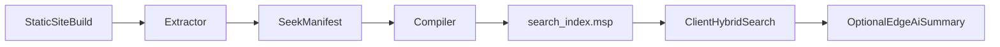

# Seek.js

Build-time extraction + hybrid search for static docs and websites.  
Seek.js converts shipped content into queryable index artifacts, then runs lexical + vector retrieval with Orama.

## TL;DR

- Input: static build output (`dist`, `build`, `out`) or local rendered output.
- Output: normalized manifest + packed search index.
- Runtime: browser-first search, optional edge AI answer layer.
- Goal: remove vector DB ops burden for docs and landing sites.

## Quickstart (5 min)

1. Build site normally.
2. Run Seek extractor on output directory.
3. Compile extracted sections into index artifact.
4. Load index in client search UI.

Example shape:

```bash
npm run build
seek extract --input ./dist --url-base https://example.com
seek compile --manifest ./seek.manifest.json --out ./public/search_index.msp
```

## Core Pipeline




## Package Roles

- `@seekjs/parser`: HTML/content extraction and section normalization.
- `@seekjs/compiler`: embedding + Orama-ready index compilation.
- `@seekjs/client`: browser hydration/cache/search primitives.
- `@seekjs/ai-edge`: optional answer streaming over retrieved chunks.

## Repo Map

- `[docs/README.md](docs/README.md)`: user-facing docs boundary and guide index.
- `[specs/README.md](specs/README.md)`: implementation contracts.
- `[specs/extractor/README.md](specs/extractor/README.md)`: extractor spec entrypoint.
- `[research/README.md](research/README.md)`: rationale, tradeoffs, experiments.

## Read Order

1. This file.
2. `[specs/extractor/01-hybrid-extraction-architecture.md](specs/extractor/01-hybrid-extraction-architecture.md)`
3. `[specs/extractor/02-seek-manifest-schema.md](specs/extractor/02-seek-manifest-schema.md)`
4. `[specs/extractor/03-extractor-compiler-contract.md](specs/extractor/03-extractor-compiler-contract.md)`
5. `[specs/extractor/04-probe-and-pivot-strategy.md](specs/extractor/04-probe-and-pivot-strategy.md)`

## Current Status

- Stage: early architecture + contract hardening.
- Primary focus: extractor correctness, URL fidelity, manifest stability.
- Public docs polish and broad integrations follow after contract freeze.

## Internal Doc Rules

Internal instructions stay outside publishable `docs/` folder.

- Public docs: `docs/`
- Contracts/specs: `specs/`
- Research/rationale: `research/`

### Canonical Terms

- `Seek Manifest`
- `Probe and Pivot`
- `Local Render Fetch`
- `static artifact parsing`

### Spec Status

- `Draft`: early, not safe to implement against.
- `Proposed`: review-ready, not final.
- `Accepted`: implementation source of truth.
- `Deprecated`: obsolete, kept for history.

### Quality Gates

- Root `README.md` <= 220 lines.
- Spec intro <= 80 lines before first normative section.
- Checklist docs <= 250 lines.
- Keep one source-of-truth per concept; other files link out.

