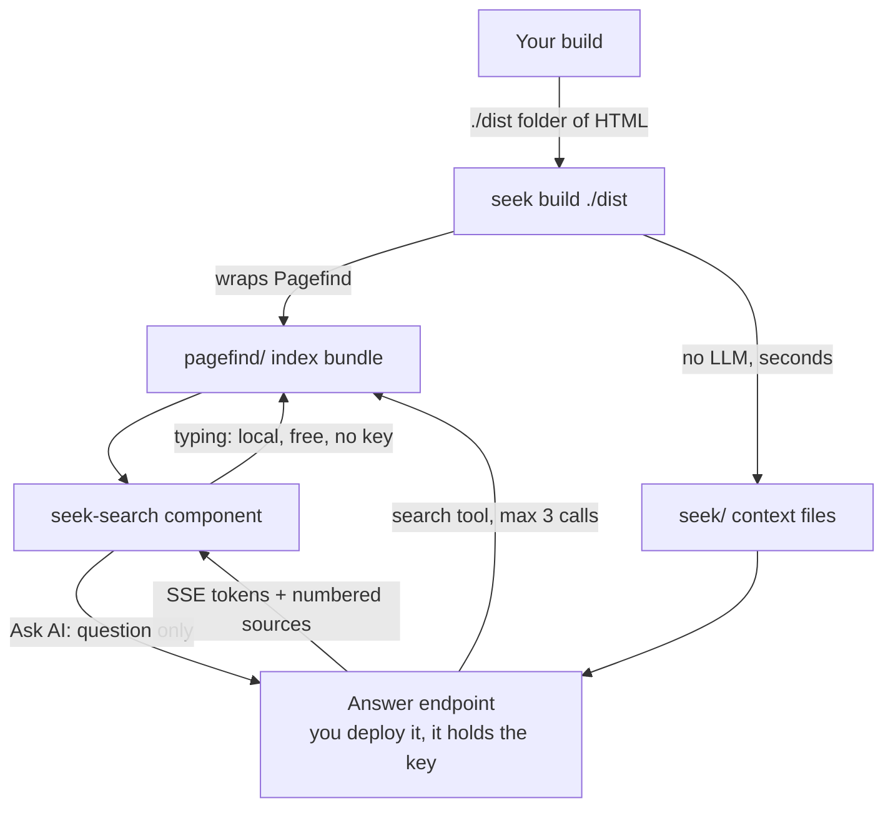

# Seek.js

AI search for any static site — one command, no backend, no vendor account.

Seek is a thin open-source integration layer, not a search engine. It wraps
[Pagefind](https://pagefind.app) for retrieval and gives you one serverless file to deploy for
grounded AI answers. **There is no SaaS, no hosted service, and no paid tier.**

> **Pre-alpha. Nothing works yet.**  
> All five packages are placeholders (`export const phase0XPlaceholder = true`). There is no
> published npm package and no working CLI. Everything below is the **target** API, written
> down so it can be reviewed before it is built. Do not follow it as installation
> instructions.

## TL;DR

- Input: a directory of built HTML (`dist`, `build`, `out`), plus an optional sitemap.
- Output: Pagefind's index bundle plus Seek's context files, as plain static files.
- As-you-type search: local, instant, free, no API key.
- "Ask AI": your own serverless function, holding your own key, streaming cited answers.
- Retrieval is Pagefind. No vectors, no embeddings, no index format of our own.

## Pipeline


```mermaid
flowchart TD
    build[Your build] -->|./dist folder of HTML| seek[seek build ./dist]
    seek -->|wraps Pagefind| bundle[pagefind/ index bundle]
    seek -->|no LLM, seconds| context[seek/ context files]
    bundle --> ui[seek-search component]
    context --> endpoint[Answer endpoint<br/>you deploy it, it holds the key]
    ui -->|typing: local, free, no key| bundle
    ui -->|Ask AI: question only| endpoint
    endpoint -->|search tool, max 3 calls| bundle
    endpoint -->|SSE tokens + numbered sources| ui
```

Because Seek reads build **output**, it is automatically framework- and language-agnostic.
Hugo, Jekyll, Sphinx, MkDocs, Astro, and Next.js all emit the same artifact.

## Target Quickstart

Not shipping behavior. This is the API under review.

1. Index your build output.

```bash
npm run build
seek build ./dist
```

2. Deploy the answer endpoint to your existing host's free tier, and set your provider key as
   a secret there. It holds the key because a static site cannot hold a secret.

3. Drop the component into your HTML.

```html
<script type="module" src="/seek/element.js"></script>
<seek-search bundle-path="/pagefind/" answer-endpoint="/api/seek/answer"></seek-search>
```

Search works with no endpoint configured; "Ask AI" is simply hidden.

## Packages

Planned layout. `packages/` currently holds pre-scope-change placeholders.

| Package | Role |
| --- | --- |
| `@seekjs/cli` | build-time: Pagefind invocation plus context file emission |
| `@seekjs/core` | headless, no DOM: state machine, Pagefind calls, answer streaming |
| `@seekjs/element` | `<seek-search>` web component; works in any HTML |
| `@seekjs/react` | `useSeek()` hook, built on `core` directly |
| `templates/` | one serverless function template per host |

## Dependency Policy

A hard rule, not an aspiration. Adding a row here requires a decision record.

| Package | Dependencies |
| --- | --- |
| `@seekjs/cli` | `pagefind` |
| worker templates | none |
| `@seekjs/core` | none |
| `@seekjs/element` | none |
| `@seekjs/react` | `react` (peer only) |

## Repo Map

- Contributing quality gate: install deps, then **`bun run check`** — aggregate script that runs
  Turbo-backed build/typecheck/test/Biome orchestration and root validators (see
  **`[specs/turbo-spec.md](specs/turbo-spec.md)`**).
- `[specs/README.md](specs/README.md)`: implementation contracts.
- `[specs/01-architecture.md](specs/01-architecture.md)`: v1 pipeline and decisions.
- `[research/00-scope-change-2026-07.md](research/00-scope-change-2026-07.md)`: why the scope
  changed, and what was cut.
- `[docs/README.md](docs/README.md)`: user-facing docs boundary and guide index.
- `[research/README.md](research/README.md)`: rationale, tradeoffs, experiments.

## Read Order

1. This file.
2. `[research/00-scope-change-2026-07.md](research/00-scope-change-2026-07.md)`
3. `[specs/01-architecture.md](specs/01-architecture.md)`
4. `[specs/02-cli-contract.md](specs/02-cli-contract.md)`
5. `[specs/03-answer-endpoint.md](specs/03-answer-endpoint.md)`
6. `[specs/04-component-contract.md](specs/04-component-contract.md)`
7. `[specs/05-grounding-and-failure-modes.md](specs/05-grounding-and-failure-modes.md)`

## Current Status

- Stage: scope redefined, contracts under review, zero implementation.
- Primary focus: freeze the CLI artifact contract, then ship `seek build`.
- Next: the `packages/` restructure to match the layout above.
- Not in scope: embeddings, a hosted service, a Python implementation, crawling.

## Internal Doc Rules

Internal instructions stay outside publishable `docs/` folder.

- Public docs: `docs/`
- Contracts/specs: `specs/`
- Research/rationale: `research/`

### Canonical Terms

- `index bundle`: Pagefind's `pagefind/` output. Seek does not define its contents.
- `context files`: Seek's own `seek/` output, consumed by the answer endpoint.
- `answer endpoint`: the user-deployed serverless function that holds the API key.
- `search tool`: the capped `search` tool the model calls against the index bundle.
- `grounded answer`: a streamed answer whose every claim carries a `[n]` citation.

### Spec Status

- `Draft`: early, not safe to implement against.
- `Proposed`: review-ready, not final.
- `Accepted`: implementation source of truth.
- `Deprecated`: obsolete, kept for history.

### Quality Gates

A list of quality gates for the AI agent:

- Root `README.md` <= 220 lines.
- Spec intro <= 80 lines before first normative section.
- Checklist docs <= 250 lines.
- Keep one source-of-truth per concept; other files link out.
- Record a scope reversal as a dated decision record in `research/`, never as an edit that
  erases the prior reasoning.
