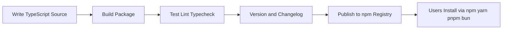
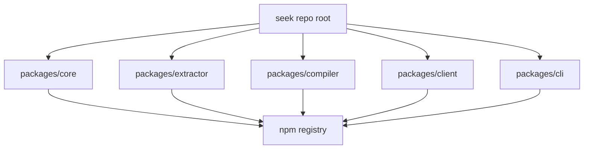
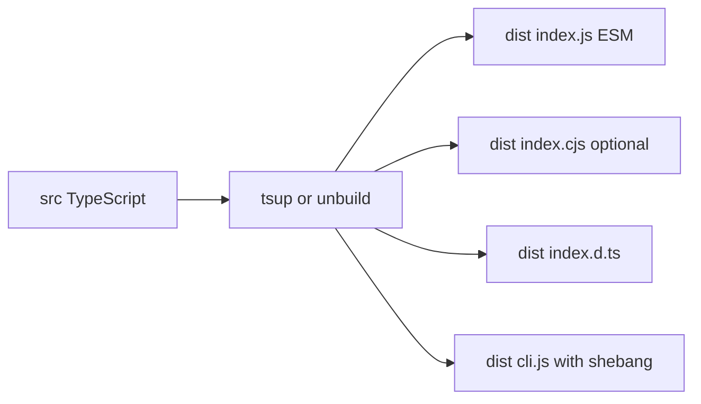
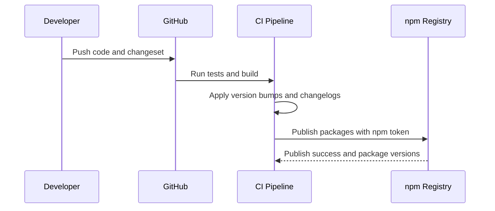

# Seek.js Package Build and Publishing Workflow

## Goal

Explain end-to-end process for building and publishing Seek.js packages (libraries + CLI) to npm registry in a framework-agnostic monorepo.

## 1) Package Lifecycle

1. Write source code (`src/*.ts`)
2. Build package (`tsup` or `unbuild`) into `dist/*`
3. Run validation (tests, lint, typecheck)
4. Bump versions and changelog (`changesets`)
5. Publish to npm registry
6. Consumers install through npm/yarn/pnpm/bun

## 2) Monorepo Model for Seek.js

One repo can host multiple packages with shared tooling and isolated outputs:

- `packages/core`
- `packages/extractor`
- `packages/compiler`
- `packages/client`
- `packages/cli`

Each package has its own `package.json`; workspace tooling links local packages during development.

## 3) Tool Responsibilities

- `pnpm workspaces`: monorepo dependency management and local package linking
- `typescript`: type system and declaration output
- `tsup` or `unbuild`: package build output (`dist`)
- `vitest`: test runner
- `eslint` + `prettier`: quality + formatting
- `changesets`: coordinated versioning and changelog generation
- `github actions`: CI automation for test/build/publish

## 4) Package Metadata Needed for Multi-Manager Consumption

Consumers can use npm/yarn/pnpm/bun when package is correctly published to npm.

Required `package.json` fields:

- `name`
- `version`
- `exports`
- `types`
- `main` / `module` (or ESM-only export map)
- `files`
- `bin` (for CLI package)

## 5) Build Outputs

### Library package

- `dist/index.js` (ESM)
- `dist/index.cjs` (optional CJS compatibility)
- `dist/index.d.ts` (types)

### CLI package

- `dist/cli.js` with shebang
- `bin` map in `package.json` (`seek` command -> built file)

## 6) Release and Publish Flow

Developer flow:

- implement change
- add changeset (`patch`/`minor`/`major`)
- merge PR

Release flow:

- changesets computes version updates + changelog
- CI publishes using npm token

## 7) Node, Bun, Deno Compatibility

- Node and Bun consume npm packages directly.
- Deno can consume npm packages (`npm:@seekjs/core`) when exports are clean ESM.
- CLI is usually Node/Bun-first; Deno CLI may need separate adapter entrypoint.

## 8) Operating Rules for Seek.js

- keep each package focused and small
- expose public API from `src/index.ts`
- avoid deep cross-package internal imports
- preserve extractor/compiler/client boundary contracts
- release frequently with small changesets

## 9) Recommended Initial Stack

For early Seek.js implementation phase:

- `pnpm workspaces`
- `typescript`
- `tsup`
- `vitest`
- `eslint` + `prettier`
- `changesets`

Add Turborepo/Nx later only when CI graph complexity justifies extra tooling.
