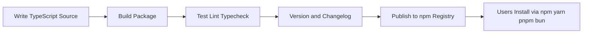
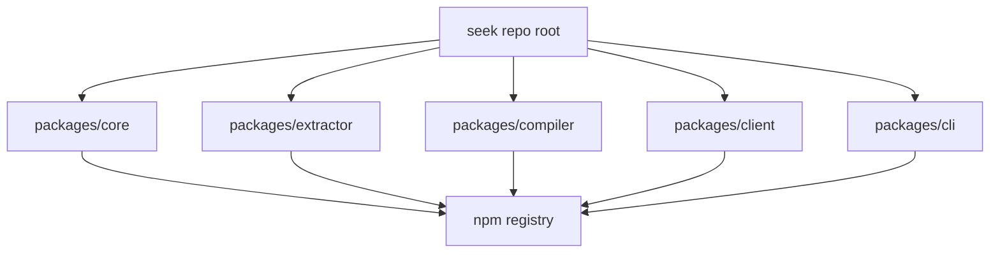
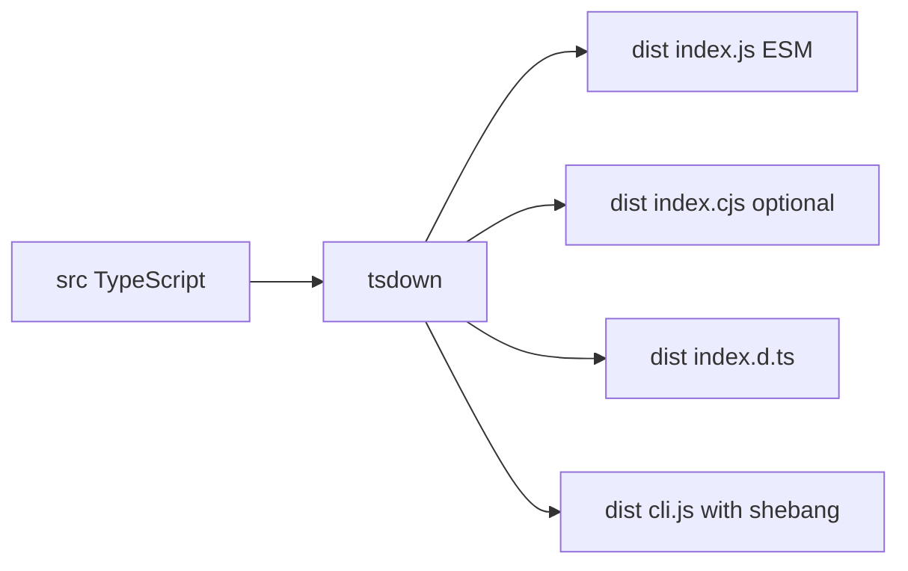
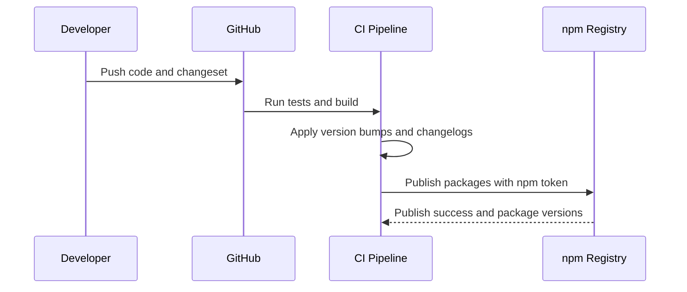

# Seek.js Package Build and Publishing Workflow

## Goal

Explain end-to-end process for building and publishing Seek.js packages (libraries + CLI) to npm registry in a framework-agnostic monorepo.

## Decision Snapshot (Web-verified)

- workspace + runtime: `bun`
- bundler: `tsdown`
- testing: `bun test`
- quality: `biome`
- versioning: `changesets`
- publishing: `bun publish`

Detail policy: this document records directional decisions and workflow shape. Exact command flags stay intentionally light here and are finalized in implementation PRs.

## 1) Package Lifecycle

1. Write source code (`src/*.ts`)
2. Build package (`tsdown`) into `dist/*`
3. Run validation (`bun test`, `biome check`, typecheck)
4. Bump versions and changelog (`changesets`)
5. Publish to npm registry (`bun publish`)
6. Consumers install through npm/yarn/pnpm/bun

## 2) Monorepo Model for Seek.js

One repo can host multiple packages with shared tooling and isolated outputs:

- `packages/core`
- `packages/extractor`
- `packages/compiler`
- `packages/client`
- `packages/cli`

Each package has its own `package.json`; workspace tooling links local packages during development.

## 3) Tool Responsibilities

- `bun workspaces`: monorepo dependency management and local package linking
- `typescript`: type system and declaration output
- `tsdown`: primary package build output (`dist`)
- `bun test`: test runner
- `biome`: lint + format + import organization
- `changesets`: coordinated versioning and changelog generation
- `bun publish`: package upload to npm registry
- `github actions`: CI automation for test/build/publish

## 4) Package Metadata Needed for Multi-Manager Consumption

Consumers can use npm/yarn/pnpm/bun when package is correctly published to npm.

Required `package.json` fields:

- `name`
- `version`
- `exports`
- `types`
- `main` / `module` (or ESM-only export map)
- `files`
- `bin` (for CLI package)

## 5) Build Outputs

### Library package

- `dist/index.js` (ESM)
- `dist/index.cjs` (optional CJS compatibility)
- `dist/index.d.ts` (types)

### CLI package

- `dist/cli.js` with shebang
- `bin` map in `package.json` (`seek` command -> built file)

## 6) Release and Publish Flow

Developer flow:

- implement change
- add changeset (`patch`/`minor`/`major`)
- merge PR

Release flow:

- changesets computes version updates + changelog
- CI publishes using Bun (`bun publish`) with npm token

## 7) Node, Bun, Deno Compatibility

- Node and Bun consume npm packages directly.
- Deno can consume npm packages (`npm:@seekjs/core`) when exports are clean ESM.
- CLI is usually Node/Bun-first; Deno CLI may need separate adapter entrypoint.

## 8) Operating Rules for Seek.js

- keep each package focused and small
- expose public API from `src/index.ts`
- avoid deep cross-package internal imports
- preserve extractor/compiler/client boundary contracts
- release frequently with small changesets

## 9) Finalized Phase-1 Stack

For early Seek.js implementation phase:

- `bun workspaces`
- `typescript`
- `tsdown`
- `bun test`
- `biome`
- `changesets`
- `bun publish`

Add Turborepo/Nx later only when CI graph complexity justifies extra tooling.

## 10) Why `tsdown` Instead of `rollup` for Phase 1

`rollup` is powerful, but Phase 1 priority is fast, low-friction package shipping while extractor/compiler contracts are still stabilizing.

Choose `tsdown` now because:

- lower config overhead
- faster onboarding for contributors
- simpler multi-package maintenance
- enough output control for library + CLI packaging

Use `rollup` later only if Seek.js needs advanced custom bundling behavior that `tsdown` cannot satisfy.

## 11) Runtime and Artifact Validation Matrix

### Runtime/install checks

| Target | Library validation                                 | CLI validation                                     |
| ------ | -------------------------------------------------- | -------------------------------------------------- |
| Node   | import package from tarball and run smoke API call | run `seek --help` from installed tarball           |
| Bun    | `bun add` tarball/package and import smoke API     | run CLI with Bun runtime path                      |
| Deno   | import via `npm:@seekjs/*` and execute smoke API   | document adapter path if Node-style bin not native |

### Artifact checks

| Check               | Expected                                                  |
| ------------------- | --------------------------------------------------------- |
| `exports` map       | resolves ESM entry (and optional CJS entry if provided)   |
| type declarations   | `.d.ts` generated and discoverable via `types`            |
| package contents    | `files` only includes required runtime assets             |
| distributable check | `npm pack` output installs and runs in clean temp project |

## 12) Implementation Checklist (bun + tsdown bootstrap)

1. create workspace packages (`core`, `extractor`, `compiler`, `client`, `cli`)
2. configure `tsdown` for library outputs (`esm`, optional `cjs`, `d.ts`)
3. configure test/quality gates (`bun test`, `biome check`, `tsc --noEmit`)
4. configure CLI package (`bin`, shebang, command entry)
5. run runtime/artifact validation matrix
6. run `npm pack` smoke install in clean temp project
7. wire CI for versioning + publish (`changesets` + `bun publish`)

## 13) Versioning vs Publishing Split

- `changesets` owns release intent (version bumps + changelog generation)
- `bun publish` owns network upload to npm
- recommended CI contract: `changesets/action` drives release state, project publish script uses Bun

This split keeps changelog quality high while retaining Bun workspace-aware publish behavior.

## 14) References

- `https://bun.sh/docs/pm/workspaces`
- `https://bun.sh/docs/pm/cli/publish`
- `https://github.com/rolldown/tsdown`
- `https://biomejs.dev/guides/getting-started/`
- `https://github.com/changesets/changesets`
