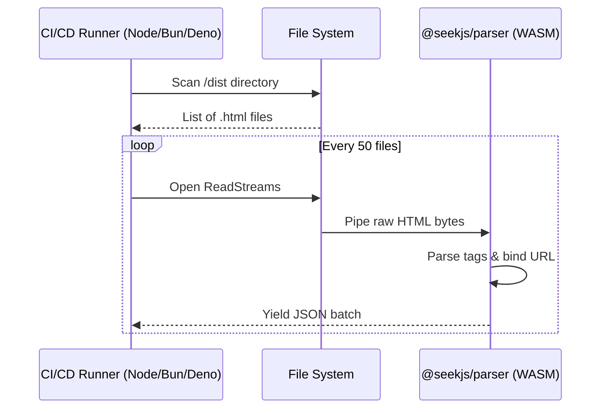
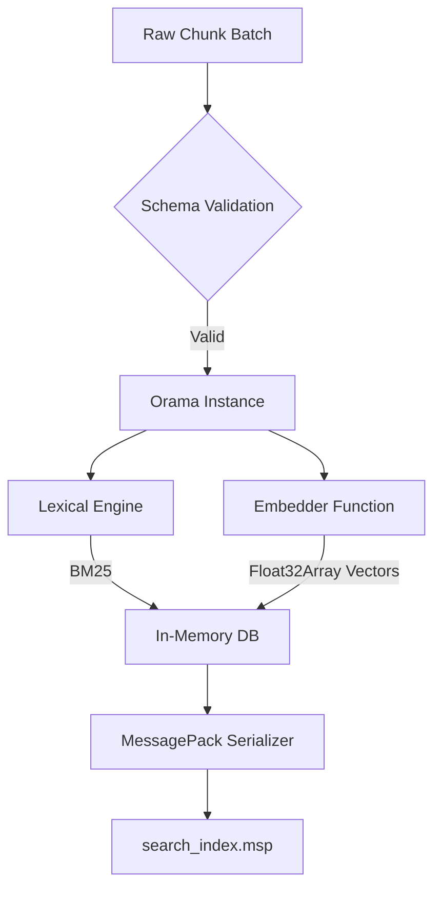
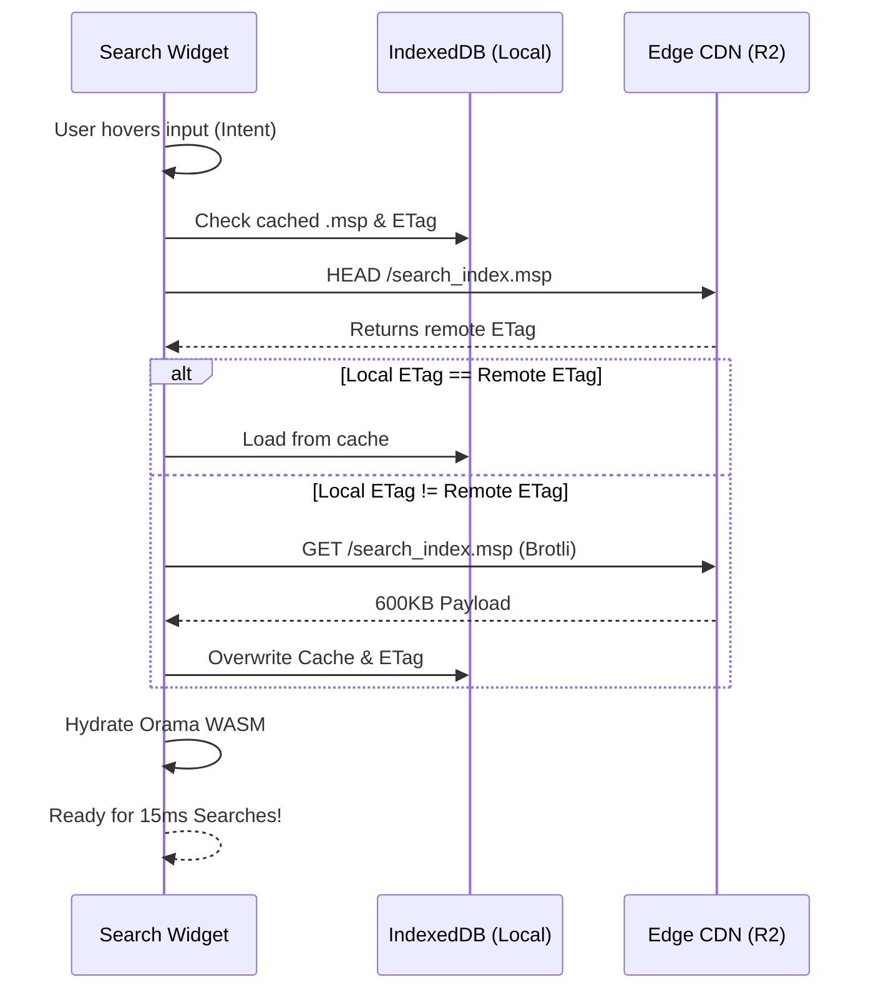
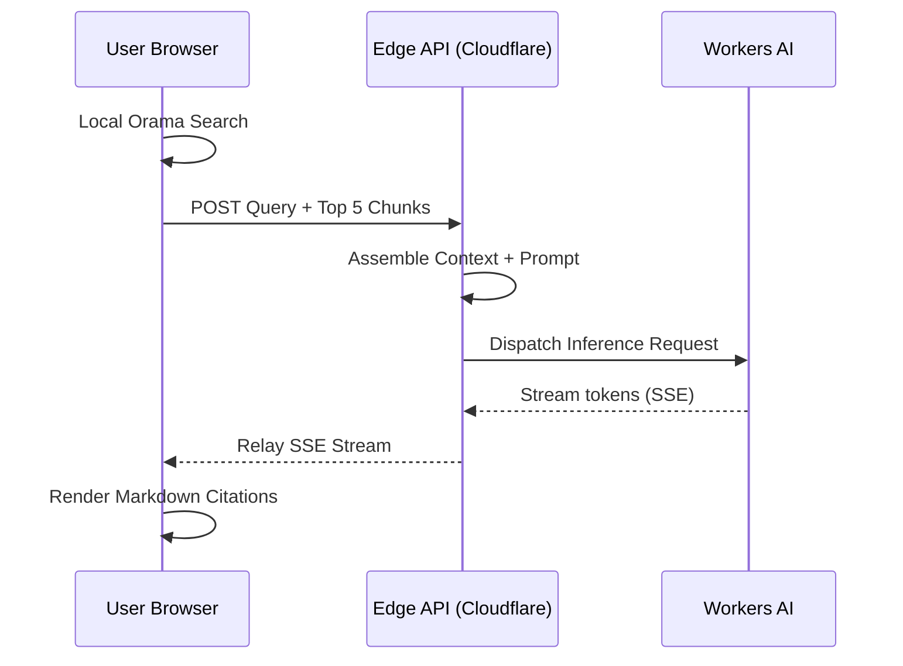

# Disaggregated AI Search: Architectural Blueprint & Experimental Roadmap

**Status:** Finalized for Experimental Phase

**Framework Name:** [Seek.js]([https://github.com/seek-js](https://github.com/seek-js)) ([@seekjs]([https://www.npmjs.com/settings/seekjs/members](https://www.npmjs.com/settings/seekjs/members)) - `@seekjs/core`)

**SaaS Platform:** `Vaan` | `Vantage` | `Koor` (Placeholder : `vaan.ai`) or some .ai domain that is cheaper

**Objective:** Deliver an "AI-search-as-a-service" toolchain that completely eliminates the "Vector Database Tax" by shifting index generation to build-time and search execution to the client's browser. Serve as the definitive engineering roadmap for building the 4 core SDK modules of the framework, outlining API contracts, data flows, and critical research paths.

---

## Executive Summary

### The Problem: The "Vector Database Tax"

In 2026, adding generative AI search (RAG) to a website is fundamentally broken for the modern frontend developer. To give users the ability to "Ask AI" about documentation or product catalogs, developers are forced to regress to legacy backend architectures. They must provision expensive managed vector databases (Pinecone, Qdrant), write fragile web-scraping ingestion scripts, and pay heavy LLM inference costs for every single user keystroke. We call this the **"Vector Database Tax."**

### The Mission: Frontend-Native AI Search

This project is a framework designed to completely eliminate that tax. We are redefining AI search not as a backend database challenge, but as a **static asset delivery** and **edge compute** challenge. Our mission is to give developers enterprise-grade AI search with the exact same developer experience (DX) as deploying a static website: *zero provisioning, zero configuration, and sub-15ms latency.*

### The Innovation: Disaggregated RAG

We achieve this by fundamentally disaggregating the RAG (Retrieval-Augmented Generation) pipeline:

1. **Shift Indexing to Build-Time:** Instead of a live database, we hook directly into the developer's framework (Next.js, Astro, Vite). We extract text using a WASM-based parser, vectorize it, and compile it into a highly-compressed binary file `.msp`).
2. **Shift Search to the Browser:** That binary file is deployed to a global CDN. The user's browser downloads it, caches it in `IndexedDB`, and executes Hybrid Search (BM25 + Vector) entirely in local memory.
3. **Shift Reasoning to the Edge:** Server-side compute is *only* invoked when a user asks for an AI summary. The browser sends local context to our Edge LLMs (Cloudflare Workers AI), which stream back cited, hallucination-free answers.

---

## 1. The Business Model: Open-Source Foundation & SaaS Monetization

- **The Open-Source Framework (Seek.js):** A free, modular SDK. Developers can install bundler plugins to extract content, generate indexes using local models, and serve search from their own static hosting. Zero vendor lock-in.
- **The SaaS Abstraction ([Vaan.ai](http://Vaan.ai)):** A managed, zero-config cloud platform. 
  - **Automated Pipeline:** We intercept the build, vectorize chunks on our Edge GPUs, and host sharded `.msp` files on our global CDN.
  - **Managed Reasoning:** We securely manage the Edge LLM endpoints required for the generative RAG summaries.
  - **Revenue:** Scalable, usage-based subscription for Edge AI compute and managed infrastructure.

---

## 2. The Competitive Advantage

By disaggregating the database, we drastically alter the performance and cost metrics for the end-user.

### Competitive Matrix (2026)

| Category | Competitors | Search Model | Architecture | Pricing (Avg) |

| :--- | :--- | :--- | :--- | :--- |

| **Static Search** | Pagefind, Stork | Lexical | Local-First | $0 (OS) |

| **Vector DBs** | Pinecone, Upstash | Vector-only | Centralized DB | **$500/mo (Prod)** |

| **AI Chat SaaS** | Mendable, [Kapa.ai](http://Kapa.ai) | RAG Chat | Centralized API | **$200+/mo** |

| **Search Engines** | Algolia AI, Orama | Neural/Hybrid | Centralized SaaS | $100 - $1,500/mo |

| **Seek.js** | **N/A** | **Hybrid** | **Disaggregated** | **$0 (OS) / $19 (SaaS)** |

### Why Seek.js Wins

1. **Against Pagefind:** Pagefind is "AI-blind." Seek.js brings **semantic intent** to the browser.
2. **Against Mendable/[Kapa.ai](http://Kapa.ai):** These are "Black Boxes" that charge for data storage and message credits. Seek.js keeps the context in the browser—you pay $0 for storage and only pennies for Edge reasoning.
3. **Against Pinecone:** No 24/7 database instance required. Your DB is a static file on a CDN.
4. **The MCP Advantage:** Seek.js natively supports the **Model Context Protocol (MCP)**, allowing your documentation to be instantly "read" by AI agents like Claude or ChatGPT.

---

## 3. The Core SDK Modules (The Pipeline)

### Module 1: Parsing & Extraction `@seekjs/parser`)

**The Goal:** Safely extract semantic text from HTML files and bind them to source URLs for citation.

#### Proposed API Contract

```javascript

import { extractHtml } from '@seekjs/parser';

const chunkStream = extractHtml({

  inputDir: './dist',

  urlBase: '[https://mysite.com](https://mysite.com)', 

  selectors: ['article', 'main .content'],

  ignorePaths: ['/404'],

  chunkSize: 50 

});

for await (const batch of chunkStream) {

  // batch: [{ text: "...", url: "/docs/auth", hash: "#setup" }]

  console.log`Extracted ${batch.length} chunks...`);

}

```

#### Data Flow (Build-Time)




### Module 2: Vectorization & Compilation `@seekjs/compiler`)

**The Goal:** Vectorize chunks and compile them into a binary MessagePack `.msp`) database.

#### Proposed API Contract

```javascript

import { compileIndex } from '@seekjs/compiler';

import { cloudflareEmbedder } from '@seekjs/embedders/cloudflare';

const mspBuffer = await compileIndex({

  chunks: chunkBatch,

  embedder: cloudflareEmbedder({ 

    apiKey: [process.env.CF](http://process.env.CF)_API_TOKEN,

    model: '@cf/baai/bge-small-en-v1.5'

  }),

  schema: {

    text: 'string',

    url: 'string',

    hash: 'string'

  }

});

```

#### Compilation Flow




### Module 3: Website Hydration & Search `@seekjs/client`)

**The Goal:** Deliver the index to the browser and execute <15ms hybrid queries locally.

#### Proposed API Contract (React)

```javascript

import { useAiSearch } from '@seekjs/react';

function SearchWidget() {

  const { search, results, status } = useAiSearch({

    indexUrl: '/search_index.msp',

    storageStrategy: 'indexedDB'

  });

  return (

    <input 

      onMouseEnter={() => search.preload()} 

      onChange={(e) => search.execute([e.target](http://e.target).value)} 

    />

  );

}

```

#### Background Sync & Cache Flow




### Module 4: The AI Generative Flow `@seekjs/ai-edge`)

**The Goal:** Stream synthesized answers with clickable citations from the Edge.

#### Proposed API Contract (Cloudflare Worker)

```javascript

import { streamAiResponse } from '@seekjs/ai-edge';

export async function POST(req) {

  const { query, chunks } = await req.json();

  

  const stream = await streamAiResponse({

    query,

    context: chunks,

    provider: 'cloudflare',

    model: '@cf/meta/llama-3-8b-instruct'

  });

  return new Response(stream, { headers: { 'Content-Type': 'text/event-stream' } });

}

```

#### Generative RAG Loop




---

## 4. Technical Complexities & Mitigation Strategies

- **The "Index Bloat" Problem:** 5,000 pages can be 15MB+. We use **int8 quantization** and **Brotli compression** to squash this under 1.5MB.
- **Abuse Prevention:** Use Cloudflare Turnstile and aggressive Edge semantic caching to prevent LLM endpoint spam.
- **Post-Build Stability:** We act as a **Vite/Rollup plugin** to hook into the build lifecycle *before* obfuscation.

---

## 5. Experimental Roadmap

1. **Experiment 1: Vector Sharding:** Test sharding a 50MB `.msp` file into 1MB fragments for incremental hydration on mobile devices.
2. **Experiment 2: LLM Citation Drift:** Measure Llama 3 8B hallucination rates on links. If >5%, fallback to manual JSON mapping of citations.
3. **Experiment 3: Cache Versioning:** Ensure schema updates gracefully wipe old `IndexedDB` versions.
4. **Experiment 4: Runtime Limits:** Stress test WASM parser against 10,000 files in Bun/Node to find the `EMFILE` break point.

---

## 6. Pricing & Infrastructure Guesstimate (Cloudflare Stack)

| Component | Cost (Seek.js / Vaan) | Cost (Pinecone + OpenAI) |

| :--- | :--- | :--- |

| **Storage (R2)** | $0.00 (within 10GB free tier) | **$160.00** |

| **Search (Local)** | **$0.00** | **$150.00** |

| **AI (10k Summaries)** | **$2.50** (Workers AI) | $5.00 |

| **Total Monthly** | **~$2.54** | **~$315.00+** |

**Monetization Strategy:** Offer a **$19/mo Pro Tier**. At a COGS of ~$2.54, we maintain an **86% margin** while saving the customer $400+/mo in "Vector Tax."

---

## 7. Final Strategy: The "Indie" Advantage

Because our architecture is **disaggregated**, we have zero server idle costs. We scale exactly with the user's traffic via Cloudflare's serverless edge.

**Our Motto:** *"Search that pays for itself."*  

Challenges in build time

### 1. Sending build files to SaaS

It is possible to send the files emitted after the build, but how do we make sure if those files have the necessary data that we need in order to generate the database (`.msp`) file for the search tool. Not all documentation sites generate markdown, mdx or HTML content.

### 2. i18n

As we are going to deal with the documentation sites, 99% of them will come with Multilingualism (i.e use of more than one language). It will be best to validate if we will me able to maintain multi language database (`.msp`) files for the search tool.

Additionally, we need to be aware that most of the documentation sites are **static** and will not required advanced i18n features such as plurals, genders etc,. But some may, which might lead to missing information of the documentation content. Look at the example below (used in ++[Docusaurus](https://docusaurus.io/)++):

```
import React from 'react';
import Layout from '@theme/Layout';
import Link from '@docusaurus/Link';

import Translate, {translate} from '@docusaurus/Translate';

export default function Home() {
  return (
    <Layout>
      <h1>
        <Translate>Welcome to my website</Translate>
      </h1>
      <main>
        <Translate
          id="homepage.visitMyBlog"
          description="The homepage message to ask the user to visit my blog"
          values={{
            blogLink: (
              <Link to="https://docusaurus.io/blog">
                <Translate
                  id="homepage.visitMyBlog.linkLabel"
                  description="The label for the link to my blog">
                  blog
                </Translate>
              </Link>
            ),
          }}>
          {'You can also visit my {blogLink}'}
        </Translate>

        
      </main>
    </Layout>
  );
}
```

These are `.js` or `.ts` files which will dynamically inject the content in the DOM.

## Optimizing performance

Finally, let's use Web Workers API to optimize hydration phase of the database (`.msp`) file as web workers does not use the main thread to execute the script (which means the main thread will not be blocked & can perform other blocking tasks seamlessly).

The client side application and the Web Worker API can communicate using `postMessage` method and `onmessage` event handler. Here is an example:

#### web-worker.js

```
onmessage = () => {
  // Fetch the `.msp` file
  fetch('https://api.seekjs.com/get-db')
  .then((response) => {
     // Can do any preprocessing if required.
     postMessage(response);
   })
  .catch((e) => {
     postMessage('Something went wrong');
   });
};
```

#### client.js

```
const myWorker = new Worker("web-worker.js");

myWorker.onmessage = (e) => {
  console.log("Message received from worker", e.data);
};
```

I will try to see how we can mitigate the first two challenges mentioned above, need some time.