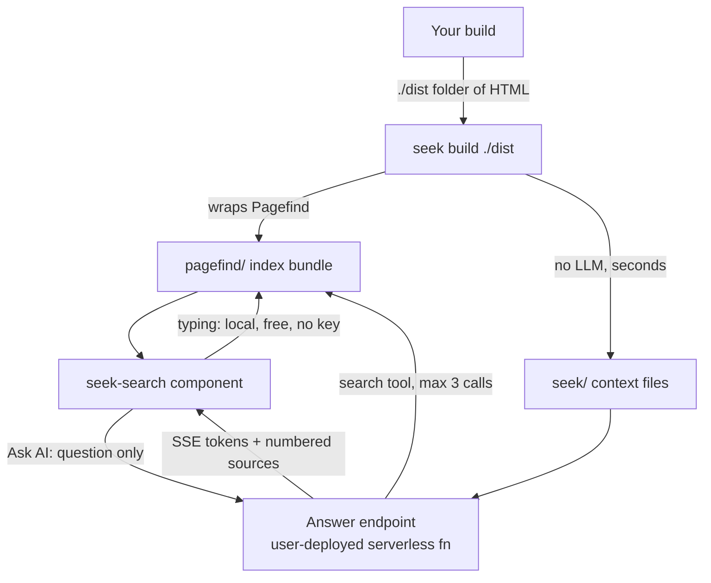

# Seek v1 Architecture

**Status:** Accepted  
**Audience:** All contributors  
**Read time:** 7 min

## TL;DR

Seek is a thin open-source integration layer, not a search engine.  
Retrieval is Pagefind. Semantics come from query-time reasoning, not build-time embedding.  
The answer endpoint is one serverless file the user deploys themselves. There is no SaaS.

## Scope

This doc defines:

- the v1 pipeline and its four stages
- the package layout and each package's boundary
- the accepted architecture decisions and their rationale
- non-goals

Artifact detail lives in `[02-cli-contract.md](02-cli-contract.md)`.  
Endpoint detail lives in `[03-answer-endpoint.md](03-answer-endpoint.md)`.  
UI detail lives in `[04-component-contract.md](04-component-contract.md)`.  
The reasoning that produced this scope lives in
`[../research/00-scope-change-2026-07.md](../research/00-scope-change-2026-07.md)`.

## Pipeline

Stage responsibilities:

| Stage | Runs | Cost | Needs a key |
| --- | --- | --- | --- |
| `seek build <dir>` | your CI, after your build | seconds, no LLM | no |
| as-you-type search | browser, local WASM | free | no |
| "Ask AI" | user's serverless fn | per answer, cached | yes |

## Architecture Decisions

### AD-1: Retrieval is Pagefind. Do not rebuild it.

`seek build` delegates all indexing to Pagefind. Seek owns no index format, no ranking, no
tokenizer, no stemming.

Reason: Pagefind already ships sharded index chunks (~300kB over the wire at 50,000 pages),
URL and anchor binding, chrome removal, a prebuilt Rust binary that needs no native
compilation step, and automatic multilingual indexing from `<html lang>` across 40+ languages
with correct per-language stemming. Rebuilding any of it is negative work.

**Contract vs implementation.** The normative contract is runtime-agnostic: a directory of
built HTML in, the artifacts of `[02-cli-contract.md](02-cli-contract.md)` out. How Pagefind
is driven is an implementation detail, deliberately excluded from the contract, so that a
future standalone binary or pip-distributed CLI can satisfy the same contract without a spec
change. For v1, `@seekjs/cli` is a Node/Bun package and drives Pagefind through its Node API
(`createIndex`, `addDirectory`, `addHTMLFile`, `writeFiles`), which is why `pagefind` is its
one dependency. This does not make the contract Node-only, and consuming a Seek index requires
no JavaScript toolchain at all.

Consequence: no vectors, no embeddings, no `.msp` format, no compiler package, no WASM parser,
no int8 quantization, no sharding work.

### AD-2: Exactly one supported input: a directory of built HTML

Plus an optional sitemap. Nothing else.

Reason: operating on build **output** makes the tool automatically framework- and
language-agnostic. Hugo (Go), Jekyll (Ruby), Sphinx and MkDocs (Python), and Next.js all emit
the same artifact: a folder of HTML. One input covers every generator without one adapter per
generator.

Consequence: probe-and-pivot escalation, source adapters, local render fetch, local headless
render, and remote crawl are all deleted.

### AD-3: Semantics come from query-time reasoning, not build-time embedding

The answer endpoint gives the model a `search` tool that queries Pagefind. If results are
thin, the model retries with different terms, capped at ~3 searches, then answers.

Reason: this is strictly better than blind query rewriting, because the model **sees** the
results before deciding what to say or search next. It also reuses the exact retrieval surface
a future MCP server exposes, so there is one retrieval implementation, not two.

### AD-4: The answer endpoint is one file the user deploys

Templates ship for Cloudflare Workers, Vercel functions, and Netlify functions. The user
deploys to their existing host's free tier.

Reason: the endpoint holds the API key, and a static site cannot hold a secret. Making it the
user's own deployment is what removes the need for a vendor account, an approval process, and
a hosted service on our side.

### AD-5: The browser sends only `{ question }`

The browser never supplies context. The endpoint owns retrieval end-to-end.

Reason: the old design POSTed `{ query, chunks }`, which is an open LLM relay. Anyone could
send arbitrary text as "chunks" and burn the site owner's API key on unrelated inference.
See `[03-answer-endpoint.md](03-answer-endpoint.md)` for the full security model.

### AD-6: Citations cannot drift, by construction

Sources are handed to the model as numbered `[1]..[n]`. The model is instructed to cite `[n]`
and to never write a URL. The client maps `n` back to the real URL.

Reason: a wrong number is a visible off-by-one, not a plausible dead link. This replaces
measuring hallucination rates with a design guarantee. Normative detail lives in
`[05-grounding-and-failure-modes.md](05-grounding-and-failure-modes.md)`.

### AD-7: One OpenAI-compatible provider adapter, no LLM framework

~150 lines of raw `fetch`. Swapping `baseURL` covers OpenAI, Groq, Gemini's OpenAI-compat
endpoint, OpenRouter, Together, DeepSeek, Mistral, and local Ollama.

LangChain is rejected: it abstracts vector stores, loaders, chains, and agents (none used),
inflates worker cold-start, has a history of edge-runtime incompatibility, and churns. Vercel
AI SDK is acceptable **later and worker-only** if a native non-OpenAI-shaped provider is
needed. Never ship an LLM SDK in the client bundle.

### AD-8: JS/TS only. There is no Python implementation.

The UI is a web component, so it drops into a Jinja template as easily as into JSX. If Python
docs teams object to Node in CI, compile the CLI to a standalone binary and publish a pip
wrapper. Pagefind itself ships via pip and precompiled binaries, so the pattern is proven.
One codebase, two install channels.

### AD-9: Dependencies are a feature

Hard rule, enforced in review:

| Package | Dependencies |
| --- | --- |
| `@seekjs/cli` | `pagefind` |
| worker templates | none |
| `@seekjs/core` | none |
| `@seekjs/element` | none |
| `@seekjs/react` | `react` (peer only) |

Reason: this is a core selling point, not an aesthetic. Adding a runtime dependency to any row
above requires a decision record.

## Package Layout

Planned. Not yet built. The pre-scope-change packages have been removed; `packages/` holds
`cli`, `core` and the internal `typescript-config`, and the rest arrive with the tickets that
need them.

| Package | Boundary |
| --- | --- |
| `@seekjs/cli` | build-time: Pagefind invocation plus context file emission |
| `@seekjs/core` | headless, no DOM: state machine, Pagefind calls, answer streaming |
| `@seekjs/element` | `<seek-search>` web component; works in any HTML |
| `@seekjs/react` | `useSeek()` hook, built on `core` directly |
| `templates/` | one serverless function template per host |

`@seekjs/react` builds on `core`, **not** on the web component. Wrapping a custom element in
React inherits refs-instead-of-props, hydration mismatches, style-isolation fights, and no
Suspense. A hook feels native. React 19 does fully support custom elements (props map to
properties, `onCustomEvent` works), so `<seek-search>` is usable in React too; the hook exists
for idiomatic feel, not necessity.

## Non-goals

- a search engine, index format, or ranking implementation
- embeddings or vector retrieval anywhere in the pipeline
- a hosted service, managed index, or paid tier
- a Python implementation of the library
- crawling, rendering, or booting a server to acquire content
- an LLM framework dependency in any package

## Change Policy

If pipeline behavior changes:

1. update the decision section here,
2. update the affected downstream spec,
3. record the reasoning in `research/` if the change reverses a decision.
