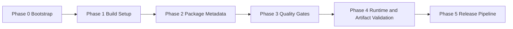

# Phase 1 Toolchain Implementation Spec (v2)

**Status:** Accepted  
**Audience:** SDK maintainers, release owners, infra contributors  
**Read time:** 15 min

## TL;DR

Seek.js Phase 1 toolchain standard:

- workspace: `bun` workspaces
- language: `typescript`
- bundler: `tsdown`
- testing: `bun test`
- quality: `biome`
- release: `changesets` (versioning) + `bun publish` (CI publish)
- task orchestration: `turbo`
- shared config: `@seek/typescript-config`

Goal: make package creation, build, validation, and publish deterministic across Node/Bun/Deno consumers with minimal setup friction.

## Scope

This spec defines phased setup and validation sequence for package tooling bootstrap, including initial workspace and package filesystem creation.

This spec does not define extractor runtime behavior contracts.

## Current-State Precondition

At acceptance time, this repository is documentation-first and does not yet contain the full package workspace implementation files (`package.json`, `packages/*`).

Phase 0 therefore includes creating those baseline files explicitly.

## Decision Context

### Accepted choices

1. `tsdown` is default package bundler for Phase 1.
2. custom Rollup-first pipeline is deferred beyond Phase 1.
3. `biome` is default linter/formatter for Phase 1.
4. `turbo` is default task orchestrator for Phase 1.
5. `@seek/typescript-config` is shared TypeScript config package.

### Why

- `tsdown` provides active path and familiar migration surface.
- `biome` unifies lint + format in single tool, faster than ESLint + Prettier combo.
- `turbo` provides efficient workspace task caching across CI/local.
- `@seek/typescript-config` provides DRY TypeScript config across packages.
- Phase 1 priority is shipping stable SDK contracts quickly, not deep bundler customization.

Detail policy: this accepted spec sets phase contracts and verification intent. Exact script flags and per-runtime command details can be finalized during implementation PRs if they preserve contract outcomes.

## Architecture View




## Determinism Definition

For this spec, "deterministic build artifacts" means:

- stable output file set under `dist/` for unchanged source and config
- stable `exports`-targeted entry paths for unchanged source and config
- no random or time-varying data embedded in emitted JS or `.d.ts`

Byte-for-byte determinism across all operating systems is not required in Phase 1 unless explicitly added later.

## Phase Breakdown

## Phase 0: Bootstrap Constraints

### Objective

Create workspace baseline and package boundaries before first build.

### Preconditions

- repository may be docs-only

### In Scope

- workspace root config
- package directory skeletons
- per-package manifests

### Out of Scope

- package runtime implementation logic

### Implementation Actions

1. Create workspace root files for package management and TypeScript base config.
2. Create package directories for `core`, `extractor`, `compiler`, `client`, `cli`.
3. Add minimal `package.json` per package with `name`, `version`, and scripts.
4. Add minimal source entry files per package.
5. Create `@seek/typescript-config` package with shared tsconfig.

Stub policy for this phase:

- minimal compile-safe placeholder source files are allowed
- placeholders must be explicit non-production scaffolding and replaced during feature implementation
- no fake runtime behavior should be documented as final SDK behavior

### File/Folder Changes

Create:

- `package.json`
- `packages/typescript-config/package.json` (now: `@seek/typescript-config`)
- `packages/typescript-config/tsconfig.base.json` (moved from root)
- `packages/core/package.json`
- `packages/core/src/index.ts`
- `packages/extractor/package.json`
- `packages/extractor/src/index.ts`
- `packages/compiler/package.json`
- `packages/compiler/src/index.ts`
- `packages/client/package.json`
- `packages/client/src/index.ts`
- `packages/cli/package.json`
- `packages/cli/src/cli.ts`

### Artifacts Produced

- workspace dependency graph
- linkable local packages

### Verification Commands

- `bun install`
- `bun run workspaces:list` (or equivalent workspace listing command)

### Exit Evidence

- install succeeds without manual local patching
- all six package names appear in recursive list output (@seek/typescript-config + 5 runtime packages)

### Failure/Exception Handling

- phase fails if workspace cannot install cleanly
- no exceptions allowed in Phase 0

### Owner

- SDK maintainer or infra contributor

## Phase 1: Build System Setup

### Objective

Standardize compile output for all packages with `tsdown` default.

### Preconditions

- Phase 0 complete

### In Scope

- package build scripts
- output format intent
- deterministic `dist/` output layout

### Out of Scope

- advanced Rollup plugin graphs
- runtime-specific divergent bundler systems

### Implementation Actions

1. Add `build` scripts in each package using `tsdown`.
2. Define format intent per package (ESM required, CJS optional, `.d.ts` required).
3. Ensure build outputs are written under package-local `dist/`.
4. Add root recursive build script via Turbo.

### File/Folder Changes

Update:

- `package.json` (root scripts)
- `packages/*/package.json` (build scripts, output intent fields if needed)
- `turbo.json` (build task definition)

Create (optional if centralized config used):

- `tsdown.config.ts`

Generated output (not committed unless policy says otherwise):

- `packages/*/dist/**`

### Artifacts Produced

- ESM build artifacts for each package
- declaration files (`.d.ts`) for each package
- optional CJS artifacts where explicitly enabled

### Verification Commands

- `bun run build`
- `bun run build && bun run build` (repeat build for stability check)

### Exit Evidence

- one recursive build command succeeds for all targeted packages
- expected file shape exists in each package `dist/`
- repeated build does not add/remove unexpected files

### Failure/Exception Handling

- phase fails if any targeted package cannot emit required ESM + `.d.ts`
- CJS omission is allowed only when package metadata is explicitly ESM-only

### Owner

- SDK maintainer

## Phase 2: Package Metadata Contract

### Objective

Ensure install and runtime resolution correctness across package managers and target runtimes.

### Preconditions

- Phase 1 complete

### Package Set Policy

Phase 2 applies full metadata contract to active publish-intended packages for current iteration.

- active package set (current): `@seekjs/extractor`, `@seekjs/cli`
- placeholder packages may keep minimal scaffold metadata until promoted to active set

When active package set changes, update this spec (or companion phase note) in same PR.

### In Scope

- package entry metadata
- export and type resolution
- package payload boundaries
- CLI `bin` mapping

### Out of Scope

- release automation

### Implementation Actions

1. Confirm active package set for current iteration.
2. Add required metadata fields in active package manifests.
3. Define `exports` and `types` contracts aligned with built outputs.
4. Define `files` allowlist to constrain publish payload.
5. For CLI package, define minimal executable contract only (entry path + `--help` smoke), not final feature surface.
6. Verify packed artifact matches declared metadata paths.

### Required package fields (active packages)

Required for active library packages:

- `name`
- `version`
- `exports`
- `types`
- `main`/`module` or equivalent explicit ESM contract
- `files`

Required for active CLI-only packages:

- `name`
- `version`
- `bin`
- `files`

Conditional for CLI package:

- `exports` and `types` are required only if CLI package exposes a runtime API for imports.

### CLI minimal metadata contract (required)

CLI package in Phase 2 must satisfy this minimum shape:

- `bin.seek` points to built CLI entry under `dist/`
- built CLI entry starts with shebang: `#!/usr/bin/env node`
- `files` includes CLI built entry and excludes source-only/internal files

### CLI API exposure rules (when importing from `@seekjs/cli`)

Only add API metadata when CLI package intentionally exposes importable runtime API.

If CLI remains command-only:

- do not add `exports`/`types` for `.` API surface
- keep contract focused on `bin` + executable behavior

If CLI also exposes API:

1. Add API entry source (for example `src/index.ts`) and include it in build output.
2. Ensure build emits API artifacts (for example `dist/index.js`, `dist/index.d.ts`).
3. Add `exports["."].import` and `exports["."].types` pointing to built API files.
4. Add top-level `types` aligned with API declaration output.
5. Re-run `npm pack --dry-run` and verify all metadata paths resolve from packed artifact.
6. Keep `bin.seek` mapped to CLI executable entry independently of API exports.

Example `packages/cli/package.json` shape (command-only):

```json
{
  "name": "@seekjs/cli",
  "version": "0.0.0",
  "type": "module",
  "bin": {
    "seek": "./dist/cli.js"
  },
  "files": ["dist"]
}
```

Example `packages/cli/src/cli.ts` header:

```ts
#!/usr/bin/env node
```

Notes:

- CLI can stay minimal in Phase 2 (for example, `--help` and stub output)
- do not encode final command architecture in this phase

### File/Folder Changes

Update:

- `packages/<active>/package.json`

Create or update:

- `packages/cli/src/cli.ts` (shebang preserved through build)

### Artifacts Produced

- resolver-safe package manifests
- CLI command mapping for install surface

### Verification Commands

- `bun run build`
- `(cd packages/extractor && npm pack --dry-run)`
- `(cd packages/cli && npm pack --dry-run)`
- `node packages/cli/dist/cli.js --help`

### Exit Evidence

- package metadata supports install via npm/yarn/pnpm/bun
- active package `exports` and `types` resolve from packed artifact shape
- CLI package exposes `seek` bin path and `--help` smoke command executes successfully

### Failure/Exception Handling

- phase fails if any active publish-intended package has missing required metadata
- phase fails if CLI `bin` target is missing, non-executable, or missing shebang after build

### Owner

- SDK maintainer

## Phase 3: Quality Gates

### Objective

Block broken outputs before runtime matrix and publish.

### Preconditions

- Phase 2 complete

### In Scope

- local checks
- CI checks (future)
- local/CI command parity

### Out of Scope

- publishing
- CI workflow implementation

### Implementation Actions

1. Add Biome linter/formatter configuration.
2. Add root scripts for format/lint and build.
3. Add per-package scripts for format/lint.
4. Configure Turbo task orchestration.
5. Fail fast on any gate failure.

### Required checks

- lint + format checks pass (`biome check`)
- build pass for all targeted packages

### Biome Configuration

Config file: `biome.json` (root)

```json
{
  "$schema": "https://biomejs.dev/schemas/2.4.12/schema.json",
  "vcs": {
    "enabled": true,
    "clientKind": "git",
    "useIgnoreFile": true
  },
  "files": {
    "includes": ["**", "!!**/node_modules", "!!**/dist"],
    "ignoreUnknown": true
  },
  "formatter": {
    "lineWidth": 120,
    "indentStyle": "space",
    "indentWidth": 2
  },
  "linter": {
    "enabled": true,
    "rules": {
      "recommended": true
    }
  },
  "javascript": {
    "formatter": {
      "enabled": true,
      "indentStyle": "space",
      "quoteStyle": "single",
      "trailingCommas": "all"
    }
  },
  "assist": {
    "enabled": true,
    "actions": {
      "source": {
        "organizeImports": "on"
      }
    }
  }
}
```

Key settings:

- VCS integration enabled (git)
- Line width: 120 characters
- Indent: 2 spaces
- Quote style: single quotes
- Trailing commas: all
- Organize imports: on

### Turbo Configuration

Config file: `turbo.json` (root)

```json
{
  "$schema": "https://turborepo.dev/schema.json",
  "tasks": {
    "format-and-lint": {},
    "format-and-lint:fix": {
      "cache": false
    },
    "build": {
      "dependsOn": ["^build"],
      "outputs": ["dist/**"]
    }
  }
}
```

Task definitions:

- `format-and-lint`: runs Biome check across workspace
- `format-and-lint:fix`: runs Biome check with write flag
- `build`: runs recursively with dependency ordering + output caching

### Scripts

Root `package.json`:

```json
{
  "scripts": {
    "workspaces:list": "bun pm ls --all",
    "build": "bun run --workspaces build",
    "format-and-lint": "biome check .",
    "format-and-lint:fix": "biome check . --write"
  }
}
```

Per-package `package.json` (each in packages/\*):

```json
{
  "scripts": {
    "build": "tsdown -c tsdown.config.mts src/index.ts --format esm --dts --out-dir dist",
    "format-and-lint": "biome check .",
    "format-and-lint:fix": "biome check . --write"
  }
}
```

### File/Folder Changes

Create:

- `biome.json`
- `turbo.json`

Update:

- `package.json` (root scripts)
- `packages/*/package.json` (per-package scripts)

### Artifacts Produced

- Biome configuration for lint/format
- Turbo task definitions
- Repeatable validation command surface

### Verification Commands

- `bun run format-and-lint`
- `bun run format-and-lint:fix`
- `bun run build`

### Exit Evidence

- Biome check passes without errors
- Build succeeds for all packages
- Formatting consistent across workspace (single quotes, 120 width)

### Failure/Exception Handling

- phase fails on any check failure
- exceptions require documented temporary waiver with expiry date

### Owner

- release owner + SDK maintainer

## Phase 4: Runtime and Artifact Validation

### Objective

Prove packaged artifacts are consumable across target environments.

### Preconditions

- Phase 3 complete for current commit

### In Scope

- runtime smoke validation from packaged artifacts
- artifact contract validation (`exports`, `types`, payload)

### Out of Scope

- performance benchmarking

### Implementation Actions

1. Pack each publishable package.
2. Install tarballs in clean temporary projects for each runtime target.
3. Execute runtime smoke checks for library and CLI.
4. Validate artifact contract checks.
5. Publish validation report as CI artifact (future).

### Runtime matrix

| Target | Library validation                                 | CLI validation                               |
| ------ | -------------------------------------------------- | -------------------------------------------- |
| Node   | install tarball, import package, execute smoke API | run `seek --help` from installed artifact    |
| Bun    | install/import and execute smoke API               | run CLI command                              |
| Deno   | import through `npm:@seekjs/*` smoke path          | document adapter path if Node bin not native |

### Artifact matrix

| Check         | Expected outcome                                |
| ------------- | ----------------------------------------------- |
| `exports` map | entry resolution correct                        |
| types         | `.d.ts` discoverable                            |
| package files | no accidental extra payloads                    |
| `npm pack`    | tarball installs and runs in clean temp project |

### File/Folder Changes

Create or update:

- `scripts/validate-runtime-matrix.*`
- `scripts/validate-artifacts.*`
- `.github/workflows/ci.yml` (or equivalent) (future)

Generated output:

- CI validation report artifact tied to commit SHA

### Artifacts Produced

- runtime compatibility report
- artifact integrity report

### Verification Commands

- `bun run validate:artifacts`
- `bun run validate:runtimes`

### Exit Evidence

- all matrix checks pass, or approved exceptions are documented
- validation report exists for same commit SHA considered for release

### Failure/Exception Handling

- phase fails on any required matrix row failure
- exceptions require explicit approval from release owner and recorded rationale

### Owner

- release owner

## Phase 5: Release Pipeline

### Objective

Publish repeatable and auditable package releases from CI only.

### Preconditions

- Phase 4 complete and green for same commit SHA

### In Scope

- changesets versioning
- changelog generation
- CI publish with npm token via `bun publish`

### Out of Scope

- manual local publish flows

### Implementation Actions

1. Configure `changesets` and release scripts.
2. Add CI release workflow with token-based publish.
3. Enforce policy: publish blocked if required prior phases are not green.

### Requirements

- versioning via `changesets`
- changelog generation from changesets
- CI publish path uses `bun publish` with npm token
- no manual ad hoc publish from unverified artifacts

### File/Folder Changes

Create or update:

- `.changeset/config.json`
- `.github/workflows/release.yml` (or equivalent)
- `package.json` (release scripts)

### Artifacts Produced

- version updates
- changelog entries
- published npm artifacts

### Verification Commands

- `bunx changeset status`
- `bunx changeset version` (when preparing release)
- CI release workflow run

### Exit Evidence

- release from CI succeeds with version + changelog coherence
- published package versions match changesets intent

### Failure/Exception Handling

- publish must fail closed if Phase 4 evidence missing for same SHA

### Owner

- release owner

## Risks and Mitigations

| Risk                 | Impact                         | Mitigation                                  | Detecting phase  |
| -------------------- | ------------------------------ | ------------------------------------------- | ---------------- |
| ESM/CJS confusion    | broken consumer imports        | explicit output intent and `exports` checks | Phase 2, Phase 4 |
| CLI runtime mismatch | command fails in some runtimes | runtime matrix smoke checks                 | Phase 4          |
| package bloat        | install/runtime inefficiency   | strict `files` and `npm pack` checks        | Phase 2, Phase 4 |
| toolchain drift      | inconsistent package behavior  | phase gates + CI enforcement                | Phase 3, Phase 5 |
| Biome config drift   | inconsistent code style        | biome.json in root + per-package scripts    | Phase 3          |

## Change Policy

When toolchain behavior changes:

1. update this spec first
2. update related research note
3. update CI/release scripts in same change set
4. re-run Phase 4 runtime/artifact matrix
5. include a short "phase impact" note in PR description describing which phase contracts changed and how reviewers verify

## Final Rule

No package is publish-ready until:

- Phase 3 quality gates pass,
- Phase 4 matrix passes (or approved exceptions exist), and
- Phase 5 release checks run from CI against same validated commit SHA.

(End of file - total 621 lines)
