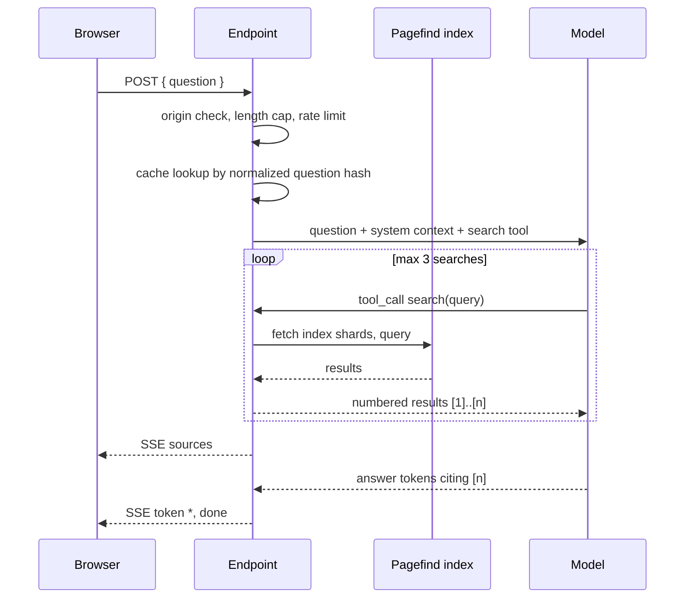

# Answer Endpoint Contract

**Status:** Proposed  
**Audience:** Template authors, endpoint deployers  
**Read time:** 10 min

## TL;DR

One serverless file the user deploys to their own host's free tier.  
In: `{ question }`. Out: SSE. It holds the API key, and it owns retrieval end-to-end.  
The browser never supplies context.

## Scope

This doc defines:

- request and response shape
- the tool-calling loop and its search cap
- the security model
- caching
- the OpenAI-compatible provider adapter

The component that calls it is `[04-component-contract.md](04-component-contract.md)`.  
Grounding and refusal rules are normative in
`[05-grounding-and-failure-modes.md](05-grounding-and-failure-modes.md)`.

## Deployment Model

The endpoint is a template, not a hosted service. Templates ship per host:

| Host | Template | Secret store |
| --- | --- | --- |
| Cloudflare Workers | `templates/cloudflare/` | Worker secret |
| Vercel | `templates/vercel/` | environment variable |
| Netlify | `templates/netlify/` | environment variable |

It exists because a static site cannot hold a secret. Everything the endpoint does could
otherwise run in the browser; the key is the only reason it is server-side.

## Request

```http
POST /api/seek/answer
Content-Type: application/json
Origin: https://example.com

{ "question": "how do I rotate an API key?" }
```

`question` is the only field the endpoint reads. Unrecognised fields are handled by one of two
rules, in this order:

1. **Reject.** A request carrying any of the reserved names `context`, `chunks`, `sources`,
   `documents`, or `messages` is rejected with `400`, whatever the value. These names are
   refused rather than ignored so a caller attempting to smuggle in context gets a hard,
   diagnosable failure instead of silently receiving an answer built from server-side
   retrieval.
2. **Ignore.** Any other unrecognised field is ignored, which keeps older deployments
   forward-compatible with clients that send fields added in a later revision.

The reserved-name list is a deliberate tripwire, not the security boundary. The boundary is
that the endpoint **only ever** builds prompts from context it retrieved itself. Accepting
caller-supplied context would turn it into an open LLM relay that anyone could point at
arbitrary text on the site owner's API key.

## Response

`text/event-stream`. Events in order:

| Event | Payload | When |
| --- | --- | --- |
| `sources` | `[{ n, title, url, excerpt }]` | once, before the first token |
| `token` | `{ "text": "..." }` | repeatedly |
| `done` | `{ "cached": false, "searches": 2 }` | once, terminal |
| `error` | `{ "code": "...", "message": "..." }` | terminal, replaces `done` |

`sources` arrives first so the client can render citation targets before `[n]` markers appear
in the stream. `n` is 1-based and matches the numbering given to the model.

Error codes: `rate_limited`, `origin_denied`, `question_too_long`, `bad_request`,
`provider_error`, `no_results`.

## Tool-Calling Loop



Rules:

1. The model is given exactly one tool: `search({ query: string })`.
2. Hard cap of **3** `search` calls per request. The 4th is refused with a tool result telling
   the model to answer from what it has or refuse.
3. The endpoint queries Pagefind itself, over the deployed `pagefind/` bundle. Retrieval is
   never delegated to the client.
4. Results are renumbered `[1]..[n]` across the whole request, deduplicated by URL, before
   being shown to the model.
5. The model is instructed to cite `[n]` and to **never write a URL**. See
   `[05-grounding-and-failure-modes.md](05-grounding-and-failure-modes.md)`.
6. If the final search set is empty or low-quality, the endpoint emits `no_results` and the
   client shows raw results instead of an improvised answer.

Retry-with-different-terms is the whole point: the model sees results before answering, which
is strictly better than rewriting the query blind. It is also the same retrieval surface a
future MCP server exposes.

## Security Model

Normative. All five are required in every template.

| Control | Rule |
| --- | --- |
| Context ownership | the browser sends only `{ question }`; the endpoint retrieves |
| Origin allowlist | validate `Origin` against a configured allowlist; reject with `403` and `origin_denied` |
| Length cap | reject questions over ~200 characters with `question_too_long` |
| Rate limit | per-IP limit (KV or Durable Object counter); reject with `rate_limited` |
| Method and content type | `POST` and `application/json` only |

Notes:

- `Origin` is not authentication. It stops casual cross-site reuse; the rate limit and length
  cap are what bound abuse cost.
- Never echo provider error bodies to the client; they can leak key metadata. Map to
  `provider_error`.
- The API key exists only in the host's secret store. It is never in `seek.json`, never in the
  bundle, never in a response.

## Caching

Answers cache by hash of the normalized question.

Normalization: trim, collapse internal whitespace, lowercase, strip trailing punctuation.

```
key = "seek:answer:" + sha256(normalize(question) + ":" + seekVersion)
```

| Property | Value |
| --- | --- |
| Store | Workers KV, or the Cache API, or the host equivalent |
| TTL | 7 days default, configurable |
| Cached value | the full `sources` payload plus the completed answer text |
| Replay | streamed back as normal SSE with `done.cached = true` |
| Invalidation | `seekVersion` in the key; a rebuild with a version bump orphans stale entries |

Docs queries repeat heavily. This is most of the cost control, and it is what keeps a free-tier
provider budget viable.

## Provider Adapter

One adapter, ~150 lines of raw `fetch` against the OpenAI chat-completions shape with tool
calling and streaming. Provider selection is a `baseURL` plus a model id.

| Provider | `baseURL` |
| --- | --- |
| OpenAI | `https://api.openai.com/v1` |
| Groq | `https://api.groq.com/openai/v1` |
| Gemini (OpenAI-compat) | `https://generativelanguage.googleapis.com/v1beta/openai` |
| OpenRouter | `https://openrouter.ai/api/v1` |
| Together | `https://api.together.xyz/v1` |
| DeepSeek | `https://api.deepseek.com/v1` |
| Mistral | `https://api.mistral.ai/v1` |
| Ollama (local) | `http://localhost:11434/v1` |

Configuration, all from the host's environment:

| Variable | Purpose |
| --- | --- |
| `SEEK_PROVIDER_BASE_URL` | one of the above |
| `SEEK_API_KEY` | provider key |
| `SEEK_MODEL` | model id |
| `SEEK_ALLOWED_ORIGINS` | comma-separated allowlist |
| `SEEK_SITE_URL` | origin used to fetch the Pagefind bundle |

LangChain is rejected; see
`[../research/00-scope-change-2026-07.md](../research/00-scope-change-2026-07.md)`. Vercel AI
SDK may be added later, worker-only, if a native non-OpenAI-shaped provider is needed. No LLM
SDK ever ships in the client bundle.

## Invariants

1. The endpoint is stateless apart from the answer cache and the rate-limit counter.
2. It never accepts model, prompt, temperature, or system-text overrides from the request.
3. It streams; it never buffers a full answer before responding, except on cache replay.
4. It never returns a URL that did not come from the Pagefind index.
5. It runs on a free tier at docs-site traffic, with the cache doing the work.
