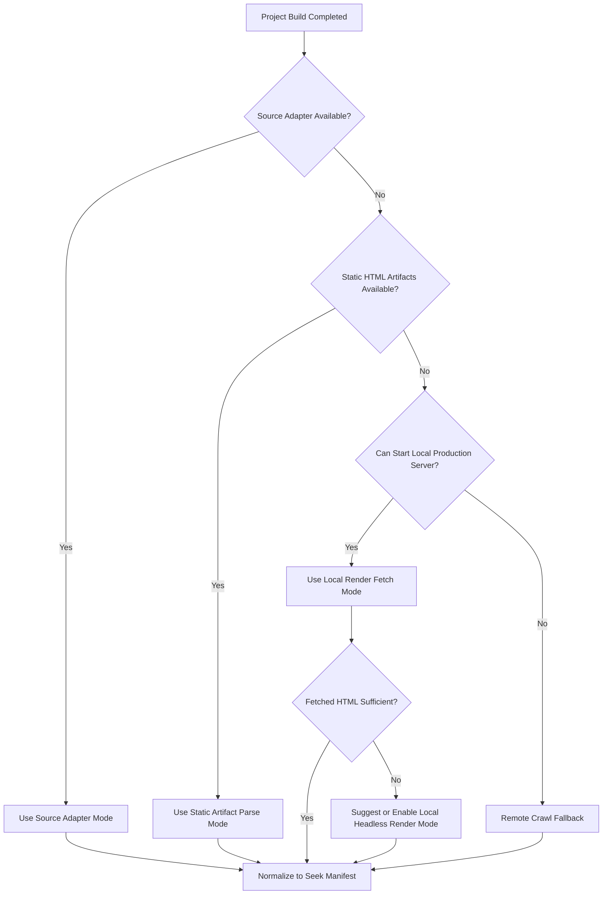

# Seek.js Hybrid Extraction Architecture
## Framework-Agnostic Content Extraction for Disaggregated AI Search

**Status:** Proposed  
**Decision Type:** Architecture RFC  
**Applies To:** `@seekjs/extractor`, `@seekjs/compiler`, Seek.js SaaS ingestion pipeline  
**Audience:** Framework authors, SDK maintainers, infrastructure engineers, product engineers

---

## Executive Summary

The first step of Seek.js is the most critical step in the entire system: **content extraction**.

If extraction is incorrect, everything downstream fails:

- citations point to the wrong pages
- chunking quality degrades
- vectorization becomes noisy
- i18n pages get mixed together
- duplicated layout content pollutes results
- browser-side search quality drops
- AI answers become unreliable

The initial version of this RFC assumed that most frameworks would provide usable built HTML artifacts in directories like `dist/`, `build/`, or `out/`. That assumption is not strong enough for the modern 2026 ecosystem.

In particular, frameworks like **Next.js App Router**, **Remix**, **Nuxt SSR**, and **SvelteKit SSR** often produce:

- server bundles
- route manifests
- React Server Component payloads
- framework-specific runtime artifacts

—not a reliable directory of final HTML pages ready for direct parsing.

That means a purely artifact-first parser would incorrectly push a large percentage of modern apps into remote crawling fallback. That would increase:

- operational cost
- latency
- authentication complexity
- user friction
- indexing instability

After additional review, the recommended architecture is a more complete and resilient variant of the original proposal:

> **Use a Contract-First Hybrid Extraction Architecture with Probe-and-Pivot acquisition.**

This means:

1. **Seek.js treats the final rendered user-visible page as the source of truth**
2. **Seek.js supports multiple local extraction modes, not only static artifact parsing**
3. **Seek.js defines a lightweight universal extraction contract**
4. **All extraction paths emit the same normalized Seek Manifest**
5. **Seek.js separates extraction modes from compile/hosting modes**
6. **Remote crawling remains a fallback, not the primary foundation**
7. **Headless rendering remains a last resort, not the default**
8. **Source adapters for MDX/Markdown-based documentation are first-class where available**

This architecture is the best balance of:

- framework independence
- deployment-provider portability
- SSR compatibility
- low adoption friction
- citation accuracy
- manageable operational complexity
- long-term extensibility

---

## 1. Problem Statement

Seek.js aims to provide AI-native search for websites and documentation sites regardless of:

- framework
- runtime
- bundler
- hosting provider
- deployment strategy

Examples of supported ecosystems should include:

- Next.js
- Astro
- Docusaurus
- VitePress
- Nextra
- Nuxt
- SvelteKit
- Remix
- plain static sites
- custom site generators
- CMS-backed static exports
- MDX/Markdown-driven doc systems
- SSR-based landing sites
- client-rendered SPAs

The extraction layer must support all of these **without** forcing Seek.js to deeply integrate with each framework's internal build graph or compilation pipeline as the default path.

At the same time, the extraction layer must preserve:

- canonical URLs
- heading anchors
- page titles
- locale/version metadata
- visible text only
- section structure for chunking and citations

This is the key technical challenge.

---

## 2. Architectural Goals

### Primary Goals

1. **Framework-Agnostic**
   - Extraction must work across many frameworks without requiring framework-specific implementation as the default path.

2. **Deployment-Provider Compatible**
   - Extraction must fit Vercel, Netlify, Cloudflare Pages, GitHub Pages, and generic CI/CD systems.

3. **SSR-Compatible**
   - Seek.js must support frameworks that do not emit parseable static HTML artifacts but can still render final HTML locally.

4. **Citation-Grade URL Fidelity**
   - Every chunk should preserve enough metadata to produce accurate links and section-level citations.

5. **Low User Friction**
   - Developers should be able to adopt Seek.js with minimal configuration.

6. **Static-First Where Possible**
   - Seek.js should prefer final rendered HTML and static assets when available.

7. **Source-Aware Where Advantageous**
   - Seek.js should take advantage of source-level adapters for MDX/Markdown-based docs systems when those paths produce better fidelity.

8. **SaaS-Compatible**
   - The open-source and managed SaaS paths must share the same normalized extraction model.

9. **Scalable to Large Sites**
   - Extraction must remain feasible for sites with thousands of pages.

---

## 3. Non-Goals

The first version of the extraction layer is **not** trying to solve all of the following:

- deep plugin integration with every framework
- browser rendering of all pages by default
- perfect extraction of arbitrary client-rendered applications without tradeoffs
- universal authenticated preview crawling as a primary ingestion path
- complete semantic understanding of all interactive components
- provider-specific indexing logic as a requirement for compatibility

These can be layered on later.

---

## 4. Constraints and Guardrails

The following constraints should guide all extraction-layer decisions.

### 4.1 Build-Time or CI-Time Only
Index generation must happen:

- locally
- in CI
- or in a managed SaaS pipeline triggered during build/deploy

It should **not** require a persistent indexing backend running after deployment.

### 4.2 Static Asset Output
The result of indexing must be deployable as plain static artifacts, such as:

- `.msp`
- optional metadata sidecars

### 4.3 Provider Agnostic
Seek.js must not require provider-specific infrastructure to function.

Optional optimizations may exist for specific providers, but they must not be foundational.

### 4.4 Build-Adjacent, Not Deep Build-Coupled
Seek.js should be **build-adjacent**, not **bundler-coupled**.

That means:

- run after build
- read final outputs where possible
- render locally through the app's own production server where needed
- crawl only as a controlled fallback
- avoid framework compiler internals whenever possible

### 4.5 Configurable Paths and Selectors
Seek.js must allow users to configure:

- input directory
- output directory
- base URL
- include selectors
- exclude selectors
- locale/version rules
- route seeds or sitemap location
- local start command
- local readiness URL or probe settings

### 4.6 Client Bundle Isolation
The extraction pipeline must be build-time only and must not bloat the browser/client SDK bundle.

### 4.7 Local-First Before Remote
If content can be extracted locally from source, local HTML artifacts, or a locally running production server, Seek.js should prefer that path before attempting remote crawling.

---

## 5. Why the First Draft Approach Was Not Enough

The initial draft direction was:

- use `html-rewriter-wasm` to parse built HTML
- combine it with some crawling
- generate chunks and compile the search database

This is directionally strong, but incomplete as a full system design.

### 5.1 The SSR Blind Spot

A static-artifact-only assumption does not hold for many modern frameworks.

For example, **Next.js App Router** often produces framework artifacts rather than a directly parseable corpus of final HTML pages. Similar issues appear in SSR-capable frameworks such as:

- Remix
- Nuxt SSR
- SvelteKit SSR

If Seek.js only supports static artifact parsing as its primary local strategy, a large share of modern frameworks would get forced into remote crawl mode.

That would undermine the goal of:

- low-friction local indexing
- deterministic CI extraction
- provider independence
- low operational cost

### 5.2 What Was Missing from Parser + Crawl Alone

A parser-only + remote-crawl-only model leaves too much to heuristics and operations:

- what counts as primary content
- what should be excluded
- which URL is canonical
- how locale/version boundaries are preserved
- how heading IDs are mapped to citations
- how duplicate content is avoided
- how SSR apps are handled locally
- how docs-source adapters fit the system
- how SaaS ingestion should behave

A stronger architecture needs:

- a formal extraction contract
- a normalized intermediate representation
- multiple local extraction modes
- a deterministic escalation path
- explicit separation between extraction and compile/hosting concerns

---

## 6. Proposed Solution: Contract-First Hybrid Extraction

### Definition

The **Contract-First Hybrid Extraction Architecture** is a system where:

1. Seek.js extracts from the best available local content source first
2. Seek.js supports a lightweight extraction contract in HTML and metadata
3. Seek.js supports source adapters for content-native ecosystems
4. All extraction modes produce a common normalized Seek Manifest
5. Seek.js uses a Probe-and-Pivot strategy to choose the right extraction mode
6. Seek.js separates extraction modes from compile/hosting modes
7. Remote crawl and headless rendering are controlled fallback paths, not the core identity of the system

### Why This Is "Hybrid"

Because it combines:

- **source-aware extraction** for Markdown/MDX-based docs systems
- **artifact-first parsing** for static sites
- **local render fetching** for SSR frameworks
- **headless local rendering** for shell-only client apps
- **remote crawl fallback** where local paths are not sufficient
- **local and SaaS compilation paths**

This is not:

- purely parser-driven
- purely crawl-driven
- purely framework-plugin-driven
- purely source-driven

It is intentionally balanced around the principle of extracting from what users actually read.

---

## 7. The Universal Extraction Contract

The core architectural improvement is the introduction of a lightweight, framework-independent extraction contract.

This contract should be expressible in final HTML and understood by Seek.js regardless of the original framework.

### 7.1 Contract Philosophy

The contract must be:

- optional
- portable
- expressive
- easy to add to any framework
- meaningful even when no adapter exists

This is similar in spirit to how some search/indexing systems use inline HTML annotations to guide indexing quality.

### 7.2 Zero-Config Semantic Defaults

Before requiring custom Seek-specific attributes, Seek.js should default to strong semantic HTML rules.

**Preferred content roots:**

- `main`
- `article`
- `[role="main"]`

**Default exclusion targets:**

- `nav`
- `footer`
- obvious top-level sidebars
- search overlays
- duplicated layout chrome

These defaults should be structure-aware rather than naive. For example:

- an article header may contain the page title and intro and should not be discarded automatically
- some `aside` content may be valuable callout content and should not always be dropped blindly
- the extraction root should determine which descendants are considered chrome versus content

### 7.3 Seek Extraction Hints

The exact attribute names are still open for refinement, but the contract may include concepts like:

- `data-seek-body`
  - marks indexable content roots

- `data-seek-ignore`
  - excludes elements and descendants from indexing

- `data-seek-title`
  - explicit page/section title override

- `data-seek-section`
  - explicit section boundary or named section

- `data-seek-locale`
  - locale identifier for subtree or page

- `data-seek-version`
  - documentation version tag

- `data-seek-noindex`
  - opt out of indexing for subtree or page

Seek.js should also respect standard metadata:

- `<link rel="canonical">`
- `<html lang="...">`
- page title
- heading IDs
- meta robots or noindex semantics
- sitemap metadata
- alternate language links where available

### 7.4 Important Principle

These hints should improve quality, but Seek.js must still work without them.

The contract is an enhancement path, not a hard requirement.

---

## 8. Normalized Intermediate Representation: Seek Manifest

Every extraction path must output the same intermediate artifact before vectorization and compilation.

This artifact is referred to in this document as the **Seek Manifest**.

### 8.1 Why the Manifest Exists

The manifest separates:

- extraction
- normalization
- chunking
- vectorization
- compilation

This gives Seek.js several advantages:

- easier debugging
- easier inspection of extraction quality
- easier parity between local and SaaS flows
- easier future adapter support
- easier incremental indexing
- easier format evolution over time
- easier route and citation validation

### 8.2 Manifest Design Principles

The manifest should be:

- deterministic
- versioned
- inspectable
- streaming-friendly
- language/runtime neutral
- portable across open-source and SaaS flows

### 8.3 Manifest Record Requirements

Each record should preserve enough information for:

- local search indexing
- deep-link citations
- AI answer grounding
- deduplication
- locale/version routing
- source provenance

### 8.4 Suggested Manifest Fields

Each normalized document/section record should include fields such as:

- `source_id`
- `sourceType`
- `canonicalUrl`
- `pageUrl`
- `pathname`
- `anchor`
- `resolvedUrl`
- `title`
- `sectionTitle`
- `headingPath`
- `text`
- `locale`
- `version`
- `contentHash`
- `pageHash`
- `noindex`
- `priority`
- `lastModified`
- `metadata`

### 8.5 Conceptual Example

A record in the manifest conceptually represents:

- one page section
- tied to one citation target
- with one cleaned text body
- in one locale/version scope
- with one stable URL identity
- with one known source provenance

The compiler can then transform the manifest into the final `.msp` search database.

---

## 9. Extraction Modes

The hybrid architecture supports multiple **extraction modes**. All of them must converge on the same manifest schema.

### 9.1 Mode A — Source Adapter Mode

**Input:**

- Markdown
- MDX
- content collections
- AST transforms
- framework content metadata

**Examples:**

- Fumadocs
- Nextra
- Astro Starlight
- MDX/Markdown documentation systems

**How it works:**

- Seek.js integrates through a content-source adapter such as a Remark/Rehype/plugin path
- the adapter emits manifest-ready section records or near-normalized extraction data
- route, title, locale, version, and heading metadata are preserved at source level
- final URL enrichment may still happen in a later normalization step

**Best for:**

- documentation systems driven primarily by Markdown/MDX
- high-fidelity docs extraction
- low-noise content acquisition
- heading-aware chunking

**Why it matters:**

HTML parsing is often the hard way around for source-native docs frameworks. When the content system already knows the heading tree, frontmatter, and page structure, Seek.js should be able to use that directly.

**Important caveat:**

Source adapters are high-fidelity paths, but they are not universal. They complement the HTML-based extraction contract; they do not replace it.

### 9.2 Mode B — Static Artifact Parse Mode

**Input:**

- built output directory
- base URL
- optional selectors and hints

**Examples:**

- `dist/`
- `build/`
- `out/`

**Best for:**

- static sites
- documentation sites
- static exports
- CI pipelines
- many landing sites
- static-site generators

**Why it is valuable:**

- deterministic
- fast
- provider-independent
- does not require network access
- aligns with classic static deployment workflows

**Important caveat:**

This mode is excellent when final HTML exists, but it must not be treated as the only local extraction path. SSR frameworks may not emit usable HTML artifacts even when the final user-visible pages are perfectly extractable locally.

### 9.3 Mode C — Local Render Fetch Mode

**Input:**

- production server start command
- readiness probe or expected local URL
- route list, sitemap, manifest hints, or internal discovery rules

**Examples:**

- Next.js App Router
- Remix
- Nuxt SSR
- SvelteKit SSR
- server-rendered landing sites

**How it works:**

1. user builds the site
2. Seek.js starts the local production server
3. Seek.js discovers routes from sitemap, route hints, or user input
4. Seek.js performs local `fetch()` requests against the running app
5. Seek.js parses the returned final rendered HTML
6. extracted content is normalized into the Seek Manifest

**Why it matters:**

This mode closes the SSR gap without forcing users into remote crawling. It preserves the local, deterministic, build-friendly philosophy of Seek.js while extracting the actual HTML users would receive.

**Why it is different from remote crawl:**

- no public preview URL required
- no allow-listing or staging auth gymnastics
- far lower latency
- fewer environmental surprises
- easier CI integration
- easier debugging

**Recommended mental model:**

This is not a generic internet crawler. It is a local render fetcher against the app's own production output.

### 9.4 Mode D — Local Headless Render Mode

**Input:**

- local routes
- local app URL
- local browser automation runtime

**Best for:**

- client-rendered SPAs
- shell-only apps where normal fetch returns almost no meaningful content
- advanced interactive pages where HTML fetch is insufficient

**How it works:**

1. Seek.js opens local routes in a headless browser
2. waits for a stable ready condition
3. captures the post-render DOM
4. extracts content through the same parser/normalization pipeline
5. emits the manifest

**Why it is fallback-only:**

- more expensive
- slower
- heavier operationally
- more brittle than source, static, or local-fetch paths

This mode should be opt-in or auto-suggested only when shell detection indicates it is necessary.

### 9.5 Mode E — Remote Crawl Mode

**Input:**

- preview URL, live URL, or sitemap
- optional auth and crawl settings

**Best for:**

- cases where local extraction paths are not available
- managed SaaS indexing workflows
- hosted sites outside the local build environment
- emergency compatibility path

**Why it is fallback-only:**

- higher operational cost
- more variance
- auth issues
- slower builds
- banner/cookie noise
- harder debugging
- greater infrastructure burden

Remote crawl should remain part of Seek.js, but it should not define Seek.js.

---

## 10. Compile and Hosting Modes

Extraction modes describe **how Seek.js finds content**.

Compile and hosting modes describe **what happens after the Seek Manifest exists**.

These concerns should be modeled separately.

### 10.1 Mode P — Local Compile

**Flow:**

1. Seek.js extracts content into the Seek Manifest
2. the local environment vectorizes and compiles the `.msp`
3. the generated index is emitted into the application's static assets

**Best for:**

- open-source self-hosting
- teams that want local control
- offline or deterministic CI pipelines

### 10.2 Mode Q — SaaS Compile

**Flow:**

1. Seek.js extracts content into the Seek Manifest
2. the manifest is uploaded to Seek SaaS
3. Seek SaaS vectorizes and compiles `.msp`
4. compiled assets are returned or hosted

**Best for:**

- minimal local compute requirements
- managed embedding workflows
- simpler onboarding
- enterprise-managed indexing

### 10.3 Mode R — SaaS Hosting

**Flow:**

1. `.msp` is compiled by Seek SaaS
2. the result is stored on a CDN or managed edge storage
3. client hydration fetches the index on demand

**Best for:**

- zero-config managed deployments
- global cache efficiency
- integrated SaaS analytics or lifecycle controls

### 10.4 Mode S — Self Hosting

**Flow:**

1. `.msp` is compiled locally or remotely
2. the user deploys it through their own static asset hosting path
3. Seek client runtime fetches it from the user-controlled origin

**Best for:**

- open-source usage
- self-hosted docs
- teams that do not want hosted search artifacts

---

## 11. Probe-and-Pivot Strategy

One of the most important operational decisions in Seek.js is not only how to extract, but **how to choose the right extraction mode automatically**.

Seek.js should implement a **Probe-and-Pivot** strategy.

### 11.1 Probe Order

Seek.js should probe in roughly this priority order:

1. source adapter availability
2. static HTML artifact availability
3. local production server start capability
4. HTML sufficiency of locally fetched routes
5. headless requirement for shell-only apps
6. remote crawl fallback

### 11.2 Suggested Decision Flow

### 11.3 Why This Matters

This prevents Seek.js from hardcoding one extraction ideology.

It also means the system can remain:

- framework-agnostic
- SSR-compatible
- efficient by default
- progressively more powerful only when needed

---

## 12. Route Discovery Strategy

One of the hardest parts of universal extraction is not HTML parsing. It is **route discovery**.

Seek.js should support route discovery in priority order:

1. explicit user-provided route list
2. sitemap
3. source adapter output
4. build output directory scan
5. framework adapter hints
6. internal link discovery
7. remote crawl discovery

### Why This Matters

This prevents Seek.js from depending on a single discovery mechanism and improves compatibility across:

- static sites
- SSR sites
- source-driven docs systems
- managed SaaS indexing paths

---

## 13. URL Fidelity and Citation Integrity

Citation accuracy is more important than extraction elegance.

Every extracted chunk should be linked to a stable citation target.

### 13.1 Citation Requirements

Each chunk should preserve:

- canonical page URL
- section anchor if available
- title
- section title
- heading hierarchy
- locale/version scope

### 13.2 URL Resolution Rules

Seek.js should:

1. prefer canonical URL metadata
2. normalize trailing slash rules
3. preserve locale/version path segments
4. avoid duplicate path variants
5. prefer existing heading IDs over synthesized ones

### 13.3 Anchor Rules

Seek.js should:

- reuse native framework-generated heading IDs when possible
- attach text to the nearest heading ancestor
- synthesize anchors only when necessary and deterministically
- avoid generating unstable citation targets

### 13.4 Source Adapter Note

Source adapters may know the heading tree early, but final anchor behavior must still remain consistent with the URLs and IDs actually exposed to users.

This means source-level extraction may still require slug or route normalization before final manifest emission.

---

## 14. Chunking Strategy

Chunking should happen after normalization and section boundary detection.

### Chunking should prefer:

- heading boundaries
- coherent semantic groups
- paragraph groups
- list groups
- bounded chunk size

### Chunking should avoid:

- blind fixed-size splits
- section merges across unrelated headings
- layout or sidebar text
- duplicate repeated content across pages

---

## 15. i18n and Versioning

Documentation sites often include:

- multiple locales
- multiple versions
- duplicated route trees
- language switchers and alternate links

### Seek.js must preserve:

- locale as first-class metadata
- version as first-class metadata
- canonical boundaries between translated and versioned content

### The manifest should allow:

- one index per locale/version
- or a combined index with metadata filters

This choice can be decided later by compiler/runtime policy.

---

## 16. Performance Strategy for Large Sites

Sites with 5,000+ pages are realistic for docs ecosystems.

### 16.1 What is scalable

- reading static build output
- streaming HTML parsing
- source adapter extraction
- local route fetching against a local production server
- batch extraction
- content-hash based incremental processing

### 16.2 What is not scalable as a default

- rendering every page in a headless browser every build
- network-dependent remote crawling for every deployment
- full recrawl on every content change
- treating remote crawl as the default SSR path

### 16.3 Required performance guardrails

- source or static parse first where possible
- local render fetch before remote crawl
- browser rendering only as fallback
- batch processing
- content hashing
- incremental index regeneration
- parallel extraction with bounded concurrency

---

## 17. Why Crawl-First Should Not Be the Primary Foundation

A crawl-first model is attractive because it appears universal.

However, crawl-first as the default foundation introduces too many operational risks:

- preview auth handling
- unstable preview URLs
- cookies/consent banners
- environment-specific content
- JS rendering costs
- incomplete route discovery
- crawl flakiness
- increased latency and cost
- difficult debugging for users

Crawling should be part of Seek.js, but it should not define Seek.js.

---

## 18. Why Framework-Specific Plugins Should Not Be the Foundation

Framework adapters are useful, but they are not the best base layer.

### 18.1 Plugin-First Drawbacks

- maintenance burden
- framework churn
- reduced universality
- poor support for the long tail of custom stacks
- higher adoption friction

### 18.2 Proper Role of Adapters

Adapters should:

- improve route discovery
- enrich metadata
- improve DX
- provide high-fidelity source extraction where a content system exists
- expose content-native extraction for MDX/Markdown ecosystems

They should not be required for basic compatibility.

### 18.3 Important Nuance

Not all adapters are equal.

A source adapter for MDX or Markdown is often a high-fidelity content acquisition layer and should be treated more favorably than deep bundler lock-in or compiler-specific integration.

Even so, the universal HTML contract and final-rendered-page philosophy remain necessary because not all sites are source-native docs systems.

---

## 19. Why Vite/Rollup Hooks Are Useful but Not Foundational

Many modern frameworks use Vite or Rollup internally.

That makes build hooks attractive for extraction, but Seek.js should be cautious.

### 19.1 Where They Help

- frontmatter enrichment
- route metadata capture
- content-source awareness
- framework-specific accelerators

### 19.2 Why They Should Not Be the Universal Core

- they reintroduce bundler coupling
- they increase maintenance burden
- they can diverge from final rendered page behavior
- they are not universal across ecosystems
- they do not replace the need for final citation-grade URL validation

### 19.3 Recommended Positioning

Treat Vite/Rollup integrations as optional adapters or accelerators, not the primary identity of the extraction architecture.

---

## 20. Runtime and Parser Decision

One important implementation decision is the extraction engine.

### Candidate A: `html-rewriter-wasm`
A JavaScript/WASM-distributed implementation of the HTMLRewriter model backed by `lol-html`.

### Candidate B: `lol-html`
The underlying Rust crate used for low-latency streaming HTML rewriting/parsing.

---

## 21. `html-rewriter-wasm` vs `lol-html`

### 21.1 The Strategic Question

The question is not only:

- which parser is fastest?

The real question is:

- which parser architecture best supports Seek.js across Node, Bun, and Deno while keeping installation friction low, avoiding native addon complexity, and preserving clean package boundaries?

This is an architectural distribution decision as much as a parser decision.

Seek.js is not trying to build a Rust-first extraction system on day one. It is trying to build a broadly adoptable extraction layer that works predictably across JavaScript runtimes and CI environments.

That shifts the decision criteria toward:

- runtime portability
- installation simplicity
- one implementation surface
- isolation from browser/client bundles
- future swappability if a lower-level engine is needed later

### 21.2 Why `html-rewriter-wasm` Is Compelling for Seek.js v1

`html-rewriter-wasm` is a strong fit for the first implementation because it offers:

#### Runtime portability
It can be used in JavaScript runtimes that support WASM and npm-style package consumption, which aligns well with:

- Node.js
- Bun
- Deno (via npm compatibility or equivalent interop)

This matters more than it appears at first glance. If Seek.js wants one extraction story across local builds, CI jobs, hosted build environments, and multiple package managers, a WASM-distributed parser is far easier to operationalize than a native-runtime strategy.

#### Low integration friction
It avoids forcing users into:

- native Rust compilation
- custom platform-specific bindings
- per-runtime native packaging complexity
- platform-dependent install failures in CI or hosted build systems

This directly improves adoption. The extraction layer is the first thing users will touch in the indexing pipeline, so it should have the lowest operational friction in the entire system.

#### Single implementation surface
A JS/WASM package allows Seek.js to keep one extraction implementation strategy across runtimes.

That reduces:

- duplicate packaging work
- runtime-specific bugs
- environment-specific support burden
- long-tail maintenance across Node/Bun/Deno combinations

#### Better SDK ergonomics
For a build-time package intended to run in many environments, install simplicity matters more than squeezing every last bit of native throughput.

Seek.js is not currently building a maximum-throughput crawler farm as its primary product surface. It is building a portable SDK and a build-friendly extraction layer. That means developer ergonomics should outweigh native-only performance in v1.

#### Bundle isolation is manageable
The extraction package is build-time only. As long as Seek.js keeps the extractor separate from the browser client packages, the parser implementation does not need to bloat the end-user search widget bundle.

This is the most important clarification in the bundle-size discussion:

> Bundle bloat is solved primarily through package boundaries, not merely through parser selection.

If `@seekjs/extractor` remains a build-only package and `@seekjs/client` only ships hydration/search runtime code, then using `html-rewriter-wasm` does not imply browser bundle inflation for the end-user search widget.

#### Backed by the right engine model
Choosing `html-rewriter-wasm` does not mean rejecting `lol-html` conceptually.

It means:

- accepting the `lol-html` parsing/rewriting model
- consuming it in a runtime-portable distribution format
- postponing native integration complexity until the product actually needs it

That is a pragmatic engineering tradeoff, not a compromise in architectural seriousness.

### 21.3 Why `lol-html` Is Still Important

`lol-html` remains strategically important because it is:

- the underlying maintained engine
- very fast
- memory-efficient
- suitable for future native integrations
- a credible long-term foundation for a lower-level extractor core

It may be the right long-term foundation if Seek.js eventually builds:

- a Rust-native extractor core
- direct bindings
- specialized high-performance extraction services
- a dedicated SaaS-side extractor service where native throughput materially matters

So the decision is not `html-rewriter-wasm` versus `lol-html` in an absolute sense.

The more precise framing is:

- use `html-rewriter-wasm` as the portability-first distribution strategy now
- keep `lol-html` as the engine-level strategic reserve for future optimization

### 21.4 Why Not Choose `lol-html` Directly for v1

Using `lol-html` directly would likely require Seek.js to own or adopt:

- runtime-specific bindings
- build/distribution complexity
- native installation workflows
- more operational overhead for multi-runtime compatibility
- a substantially more complex support matrix for Node/Bun/Deno

That increases friction for the exact environments Seek.js wants to support broadly.

In other words, direct `lol-html` integration optimizes for a future that Seek.js has not yet earned operationally.

It may absolutely become the right decision later, but for the `init` branch it would front-load complexity in the wrong place:

- packaging
- installation
- runtime support
- CI portability

Those are precisely the areas where Seek.js should remain conservative early on.

### 21.5 Decision Framing

For **v1**, the recommendation is:

> Prefer `html-rewriter-wasm` for portability, runtime coverage, ease of integration, and minimal adoption friction across Node, Bun, and Deno.

For **long-term architecture**, keep open the option to:

> graduate toward a more direct `lol-html` integration if profiling shows clear need, native throughput becomes materially important, and the maintenance cost is justified.

The parser decision should therefore be treated as an implementation-layer choice, not a permanent product constraint.

Seek.js should intentionally preserve the ability to evolve from:

- portable WASM-backed extraction now
- to a more native extractor strategy later

without forcing a redesign of the overall hybrid extraction architecture.

---

## 22. Recommendation on Parser Packaging

### 22.1 Recommended Principle

The extraction parser must live in a build-time package boundary, such as:

- `@seekjs/extractor`

It must **not** be bundled into:

- `@seekjs/client`
- browser widgets
- runtime hydration code

Seek.js should also avoid exposing the concrete parser package as the long-term architectural boundary. Instead, the public extraction pipeline should be designed around an internal engine abstraction so that the underlying parser can change later without rewriting the rest of the system.

### 22.2 Why This Matters

This resolves the bundle-size concern directly.

The parser can be larger and more capable because it is not part of the browser search payload.

It also protects Seek.js from over-coupling to one parser distribution strategy too early.

### 22.3 Practical Outcome

Seek.js can optimize for:

- cross-runtime build portability
- extraction quality
- maintainability
- future engine replacement without pipeline redesign

without hurting end-user browser bundle size.

### 22.4 Recommended Implementation Pattern

Internally, Seek.js should define the extraction flow around an engine boundary, for example:

- HTML input acquisition
- DOM/stream traversal
- content region identification
- heading and anchor extraction
- normalized record emission

That way Seek.js can start with `html-rewriter-wasm` and later move to:

- direct `lol-html`
- a custom maintained WASM wrapper
- a Rust-core extractor service

without rewriting the higher-level extraction contract or manifest pipeline.

---

## 23. SaaS Architecture Recommendation

The managed Seek SaaS path should prioritize:

### First-class

- local extract
- manifest upload
- remote compile
- remote hosting of `.msp`

### Secondary

- remote crawl
- preview/live site extraction
- browser-rendered crawl

This ordering is important.

### Why

Remote compile is:

- cheaper
- more deterministic
- easier to debug
- more secure
- easier to scale

Remote crawl should remain available as a fallback and premium capability, not the default contract.

---

## 24. Risks and Mitigations

### Risk: poor extraction defaults
**Mitigation:** use semantic HTML defaults first, then support HTML contract hints and selectors.

### Risk: wrong citation URLs
**Mitigation:** canonical-first URL resolution and anchor preservation.

### Risk: SSR frameworks have no parseable build HTML
**Mitigation:** support Local Render Fetch Mode as a first-class local path.

### Risk: large-site performance issues
**Mitigation:** source/static/local-fetch-first ordering, incremental hashing, bounded concurrency.

### Risk: runtime fragmentation
**Mitigation:** use a portable WASM-based parser in v1 and keep parser isolated to build-time packages.

### Risk: crawl complexity overwhelms the product
**Mitigation:** position remote crawl as fallback, not primary architecture.

### Risk: source adapters drift from final page behavior
**Mitigation:** normalize routes, anchors, and canonical metadata through the manifest pipeline.

### Risk: future lock-in to one extraction path
**Mitigation:** normalize everything into the Seek Manifest and keep the parser/engine abstracted.

---

## 25. Recommended v1 Scope

### Build in v1

- lightweight extraction contract
- semantic HTML defaults
- Seek Manifest
- Source Adapter Mode for MDX/Markdown-friendly docs systems
- Static Artifact Parse Mode
- Local Render Fetch Mode
- Local Compile
- SaaS Compile/Hosting
- Probe-and-Pivot strategy
- Local Headless Render Mode as opt-in or fallback
- Remote Crawl Mode as controlled fallback

### Postpone to v2+

- broad deep-framework plugin ecosystems
- authenticated/staging crawl as a default path
- browser rendering by default
- deeply provider-optimized workflows
- assuming every content system should have a bespoke adapter before Seek.js can function

---

## 26. Final Decision

Seek.js should adopt a **Contract-First Hybrid Extraction Architecture** with **Probe-and-Pivot extraction selection**.

### In One Sentence

> Seek.js will extract from the best available local representation of user-visible content—preferably source adapters, static HTML artifacts, or locally rendered HTML—normalize all extracted data into a common Seek Manifest, and reserve headless rendering and remote crawling for controlled fallback paths.

### Why This Is the Right Path

This architecture:

- supports the broadest range of frameworks
- works across major deployment providers
- closes the Next.js App Router / SSR blind spot
- avoids deep framework coupling
- preserves citation fidelity
- scales better operationally than crawl-first
- remains compatible with both OSS and SaaS models
- keeps the client bundle clean
- gives Seek.js room to evolve without rewriting the pipeline

This is the safest and strongest foundation for the project.

---

## 27. Final Recommendation on `html-rewriter-wasm`

For the Seek.js extractor implementation:

### Use `html-rewriter-wasm` first if the priority is:

- portability across Node/Bun/Deno
- one build-time implementation
- low user installation friction
- avoiding native build complexity
- keeping client/browser bundles unaffected through package boundaries
- reducing CI and hosted-build environment friction
- preserving one extraction story across JavaScript runtimes

### Keep `lol-html` in architectural reserve if the priority later becomes:

- maximum throughput
- tighter native control
- Rust-core extraction engine
- specialized high-scale extraction services

### Final Stance

For the `init` branch and the first viable architecture:

> `html-rewriter-wasm` is the better implementation choice for Seek.js than direct `lol-html` integration, because Seek.js needs broad runtime portability, low adoption friction, and clean build-time package isolation more than it needs native-only performance at this stage.

The important nuance is that this is not a rejection of `lol-html`. It is a sequencing decision.

Seek.js should:

- use `html-rewriter-wasm` now for runtime portability
- isolate parser code to build-time packages so browser bundles remain clean
- preserve an internal engine abstraction so the parser implementation can evolve later

That gives Seek.js the best combination of:

- immediate universality
- low operational friction
- architectural flexibility

---

## 28. Next Steps

1. Define the Seek Extraction Contract formally
2. Define the Seek Manifest schema
3. Design the extractor package API
4. Define the Probe-and-Pivot decision logic
5. Define local server lifecycle configuration for Local Render Fetch Mode
6. Prototype extraction on:
   - one static docs site
   - one Next.js App Router docs site
   - one MDX/Markdown docs system
   - one i18n docs site
   - one SSR landing site
   - one SPA requiring local headless fallback
7. Measure:
   - extraction accuracy
   - URL fidelity
   - chunk quality
   - build/runtime costs
   - large-site scalability
   - SSR extraction reliability

---

## 29. Proposed Motto for the Extraction Layer

> **"Extract from what users actually read, not what frameworks internally generate."**

That principle should remain the foundation of Seek.js.